##############################################################################
0. Chapter Software installation and Test (Necessary)
##############################################################################

**If you have any concerns, please feel free to contact us via** support@freenove.com

In this chapter, we will do some necessary preparation work: start your Pi Raspberry and install some necessary libraries.

If you are using remote desktop mode to login Raspberry Pi, you need use :ref:`VNC viewer`.

Step 0.1 Obtain the Code (Don|t skip this section.)
*************************************************************

Type the following commands in the terminal to obtain the code for the smart car. And place the code in the user directory "Pi". 

:red:`(Note: Here are two commands. Please execute commands in order.) Don|t transmit code from VNC, it may cause errors.`

.. code-block:: console

    $ cd ~
    $ git clone http://github.com/Freenove/Freenove_Three-wheeled_Smart_Car_Kit_for_Raspberry_Pi.git

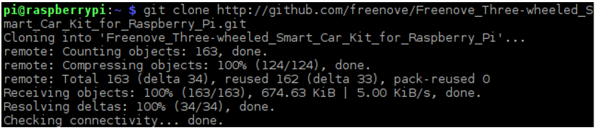

You can also find and download the code in Raspberry Pi by visiting our official website (http://www.freenove.com) or our GitHub repository (https://github.com/freenove).

Please notice that our code for this smart car is written with Python3.

Set Python3 as default python (Don|t skip this section.)
===============================================================

First, execute python to check default python on your raspberry Pi. Press Ctrl-Z to exit.

If it is python3, you can skip this section.

If it is python2, you need execute following commands to set default python to python3.

1.	Enter directory /usr/bin 

.. code-block:: console
    
    $ cd /usr/bin

2.	Delete the old python link.

.. code-block:: console
    
    $ sudo rm python

3.	Create new python links to python.

.. code-block:: console
    
    $ sudo ln -s python3 python

4.	Check python. Press Ctrl-Z to exit.

.. code-block:: console
    
    $ python

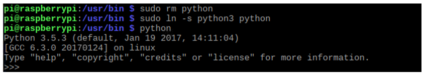

If you want to set python2 as default python in other projects.

Just repeat command above and change python3 to python2.

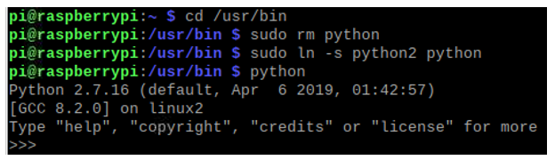

Shortcut Key
---------------------------

Now, we will introduce several shortcuts that are very useful and commonly used in terminal.

1. up and down arrow keys. History commands can be quickly brought back by using up and down arrow keys, which are very useful when you need to reuse certain commands.

When you need to type command, pressing “↑” will bring back the previous command, and pressing “↓” will bring back the latter command.

2. Tab key. The Tab key can automatically complete the command/path you want to type. When there are multiple commands/paths conforming to the already typed letter, pressing Tab key once won’t have any result. And pressing Tab key again will list all the eligible options. This command/path will be directly completed when there is only one eligible option.

As shown below, under the |~|directory, enter the Documents directory with the “cd” command. After typing “cd D”, press Tab key, then there is no response. Press Tab key again, then all the files/folders that begin with “D” is listed. Continue to type the character "oc", then press the Tab key, and then “Documents” is completed automatically.

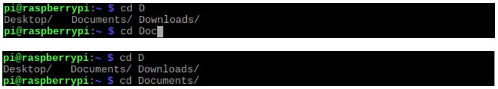

Step 0.2 Configure I2C
********************************

Enable I2C
===========================

The I2C interface raspberry pi is closed in default. You need to open it manually. You can enable the I2C interface in the following way.

open the terminal:

Type command in the terminal:

.. code-block:: console
    
    $ sudo raspi-config

Then open the following dialog box:

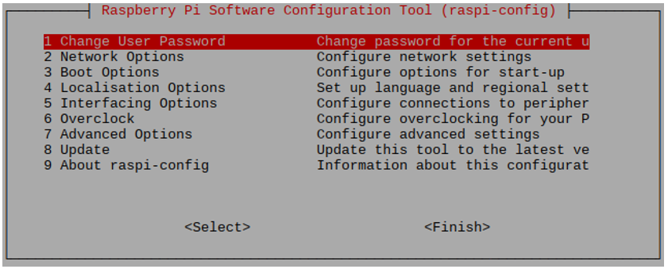

Choose “5 Interfacing Options”“P5 I2C”“Yes”“Finish” in order and restart your RPi later. Then the I2C module is started.

Type a command to check whether the I2C module is started:

.. code-block:: console
    
    $ lsmod | grep i2c

If the I2C module has been started, the following content will be shown:

Install I2C-Tools
==================================

Type the command to install I2C-Tools.

.. code-block:: console
    
    $ sudo apt-get install i2c-tools

I2C device address detection:

.. code-block:: console
    
    $ i2cdetect -y 1

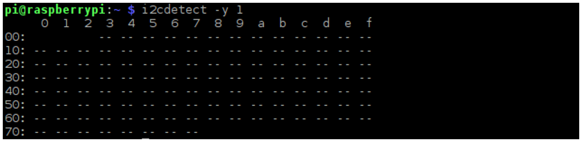

If there are I2C devices connected to your RPi, here will display their I2C device address.

Install python-smbus
================================

Python-smbus is a module of the program Python, which contains some classes and methods to operate I2C.

Type the following command to install python-smbus:

.. code-block:: console
    
    $ sudo apt-get install python-smbus

Communication test
==========================

Follow the steps below to connect the Shield with the RPi.

+-------------------------------------------+---------------------------------+
| 1.Prepare the following boards and parts. | 2. Assembly                     |
|                                           |                                 |
| |Chapter00_09|                            | |Chapter00_10|                  |
+-------------------------------------------+---------------------------------+
|3.Use Jumper Wire F-F to connect the Shield with I2C port of RPi.            |
|                                                                             |
|Use the battery box to supply power for the Shield,                          |
|                                                                             |
|and open the switch S1.                                                      |
|                                                                             |
|RPi can be powered by USB power port,                                        |
|                                                                             |
|or external power supply adapter.                                            |
|                                                                             |
||Chapter00_11|                                                               |
|                                                                             |
|:red:`If there is no LED ON after turn on the switches,`                     |
|                                                                             |
|:red:`please push batteries to positive ends of the battery holder.`         |
+-----------------------------------------------------------------------------+

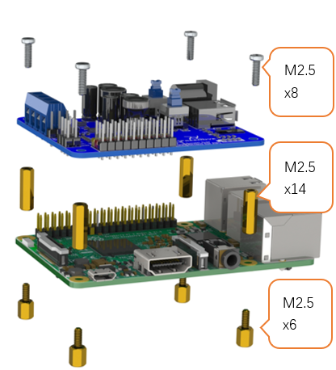
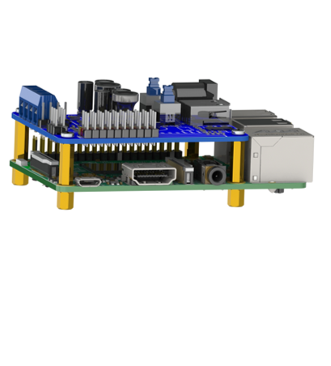
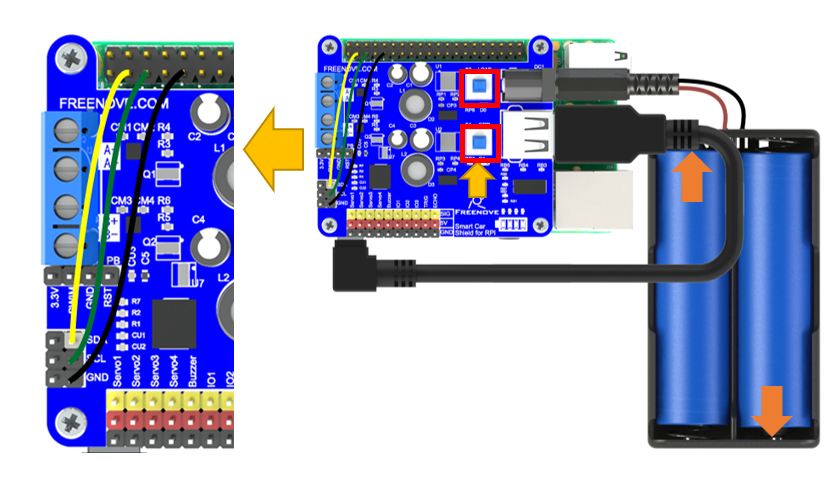

Default I2C address of the Shield is 0x18. Execute command i2cdetect-y1 again to detect whether the shield is connected to RPi successfully.

.. code-block:: console
    
    $ i2cdetect -y 1

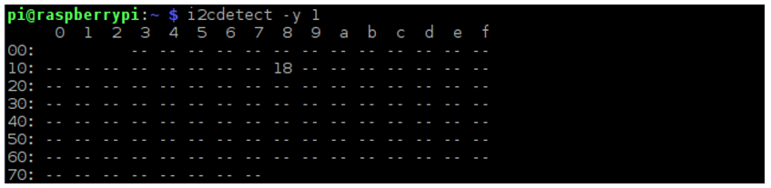

**If you cannot detect i2c. Please check to S1 and S2 is press, Or try following method to reset.**

**Keep the power on and connect GND and RST with one F/F jumper. Then disconnect GND and RST. Then detect i2c again to try.**

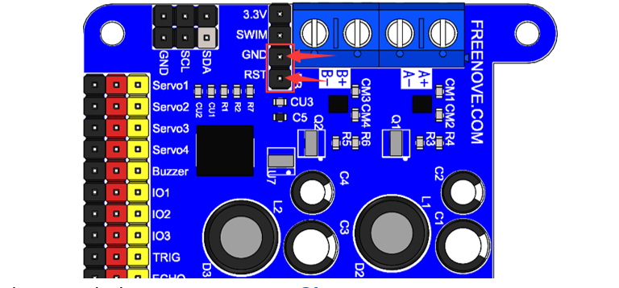

If it does not work, please contact us at support@freenove.com

Step 0.3 Install mjpg-streamer
*****************************************

Camera is driven by mjpg-streamer. So you need to install mjpg-streamer.

Install
=================================

Open the terminal and execute the following command to install.

1.	Install the relay for mjpg-streamer:

.. code-block:: console
    
    $ sudo apt-get install libv4l-dev
    $ sudo apt-get install libjpeg62-turbo-dev
    $ sudo apt-get install imagemagick

2.	You may also need to install SVN if it is not installed in your raspberry pi。
    
.. code-block:: console
    
    $ sudo apt-get install subversion

3.	Generate executable file mjpg-streamer: (Note: Here are two commands. Please execute  commands in order.)

.. code-block:: console
    
    $ cd ~/Freenove_Three-wheeled_Smart_Car_Kit_for_Raspberry_Pi/mjpg-streamer
    $ make USE_LIBV4L2=true clean all

Test mjpg-streamer
==================================

Connect the camera to any one of the USB ports on the RPi. And execute the following command to verify that the camera is successfully connected to RPi.

.. code-block:: console
    
    $ ls /dev/video*

If the results list the video0, the camera is connected successfully.

Under the mjpg-streamer directory, execute the following command to open the mjpg-streamer service.

.. code-block:: console
    
    $ cd ~/Freenove_Three-wheeled_Smart_Car_Kit_for_Raspberry_Pi/mjpg-streamer
    $ sh Start_mjpg_Streamer.sh

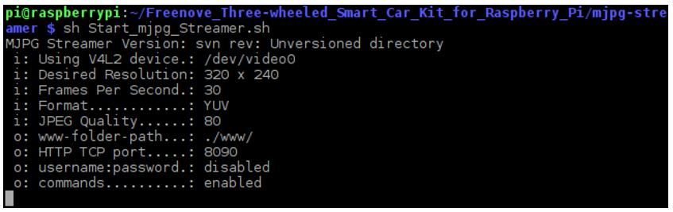

Open Web browser of RPi, access to http://127.0.0.1:8090/ or http://localhost:8090/. Then the following picture appears.

Click the "Javascript" tab on the left of navigation bar, then you will be see the real-time picture of the camera. If the picture is not clear enough, you can rotate the lens to adjust the focus.

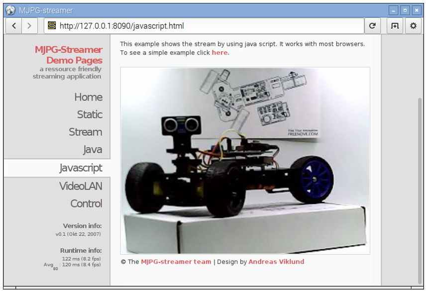

You can access this page through accessing http://xxx.xxx.xxx.xxx:8090/ with your Web browser of your PC or mobile phone. This requires your PC or mobile phone to be in the same local area network with your RPi, where xxx.xxx.xxx.xxx is IP address of RPi. For example, my RPi IP address is 192.168.1.108. In the Windows 10, access to  http://192.168.1.108:8090/  through the browser, as is shown below.

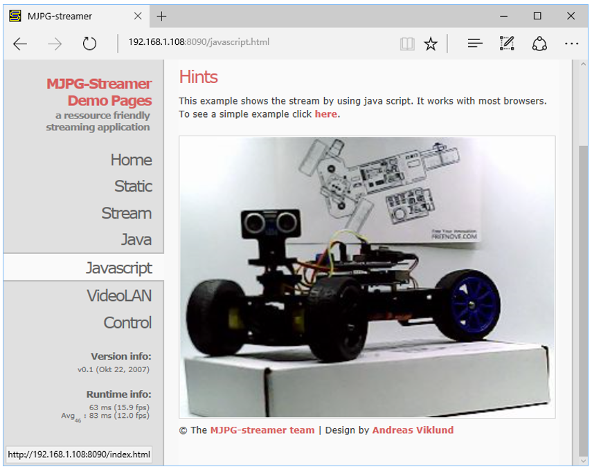

Step 0.4 Install PyQt5
*********************************

The project code is based on PyQt5. So operation of the program requires the support of PyQt5.

Open the terminal and execute the following command to install PyQt5. (Note: Here are four commands. Please execute  commands in order.)

.. code-block:: console
    
    $ sudo apt-get update
    $ sudo apt-get install python3-pyqt5
    $ sudo apt-get install python3-pyqt5.qtwebkit
    $ sudo apt-get install python3-dev

After the installation completed, type the following command to test whether PyQt5 is installed successfully. 

:red:`(Note: Here are two commands. Please execute  commands in order.)`

.. code-block:: console
    
    $ cd ~/Freenove_Three-wheeled_Smart_Car_Kit_for_Raspberry_Pi/Server
    $ python Main.py

If you can run it successfully, and the following picture appears, it means that PyQt5 has been successfully installed. Then click on the top right corner to close the program.

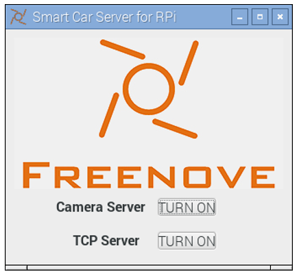

.. _0.5_test:

Step 0.5 Test
***********************

Next, test the servo, motor, buzzer, RGBLED module and so on.

Servo
==========================

The servo can be connected with rocker arm to drive other parts to move. There are 3 kinds of rocker arm, and 3 screws for the servo. The smaller screw is used to fix the rocker arm onto servo.

+-------------------------------------------------------------------------------------+
| The servo can be connected with rocker arm to drive other parts to move.            |
|                                                                                     |
| There are 3 kinds of rocker arm, and 3 screws for the servo.                        |
|                                                                                     |
| The smaller screw is used to fix the rocker arm onto servo.                         |
|                                                                                     |
| |Chapter00_20|                                                                      |
+-------------------------------------------------------------------------------------+
| You can install or remove the rocker arm as below.                                  |
|                                                                                     |
| Don't install the screw first.                                                      |
|                                                                                     |
| |Chapter00_21|                                                                      |
+-------------------------------------------------------------------------------------+
| You can turn the rocker arm to rotate in the range from 0 to 180 degrees with hand: |
|                                                                                     |
| |Chapter00_22|                                                                      |
+-------------------------------------------------------------------------------------+
| Servo has three lines for controlling.                                              |
|                                                                                     |
| The orange one is for the signal line, the red line for the power VCC,              |
|                                                                                     |
| the black one for the power GND.                                                    |
|                                                                                     |
| |Chapter00_23|                                                                      |
+-------------------------------------------------------------------------------------+

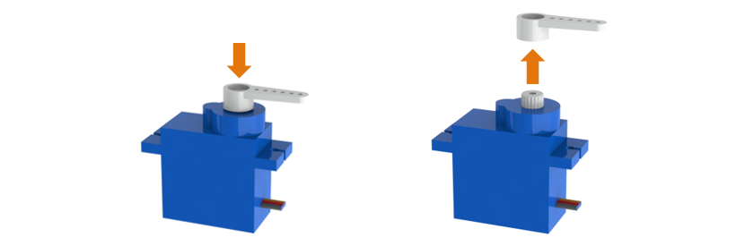

According to the following steps, connect any one of servos to the Servo1 port of the Shield. Open the switch S2, then the servo will rotate to 90 degrees automatically.

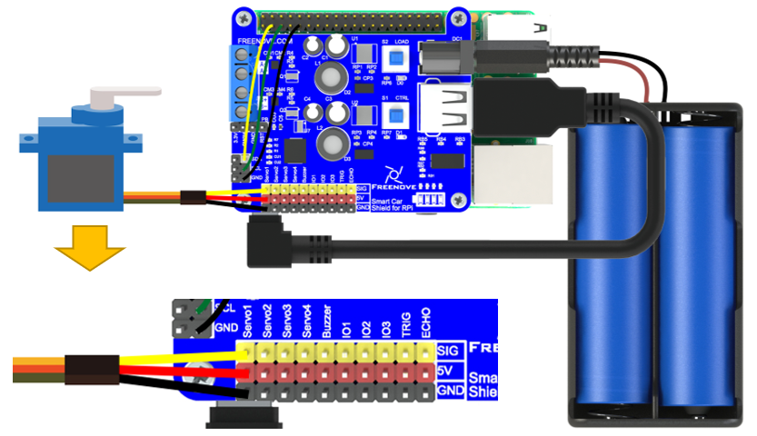

Type the following command in the terminal to test the servo: 

:red:`(Note: Here are two commands. Please execute  commands in order.)`

.. code-block:: console
    
    $ cd ~/Freenove_Three-wheeled_Smart_Car_Kit_for_Raspberry_Pi/Server
    $ python mDev.py servo

Then, the servo will rotate back and forth in a certain range. 

After the test is completed. The servo will stop at 90 degrees. Then remove the rocker arm, and then pull off the servo line. After that, do not rotate the servo manually not to affect the following installation. Make all other servos to rotate to 90 degrees according to this method.

Buzzer
=========================

Connect the buzzer module to the buzzer port in the Shield.

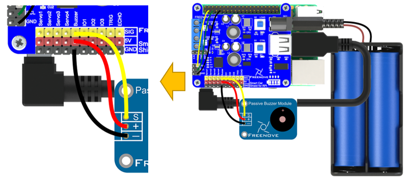

Type the following command. Then the buzzer will start to sound. The program will exit 3 seconds later, then the buzzer stop sounding. (Note: Here are two commands. Please execute commands in order.)

.. code-block:: console
    
    $ cd ~/Freenove_Three-wheeled_Smart_Car_Kit_for_Raspberry_Pi/Server
    $ python mDev.py buzzer

Motor 
=========================

Connect the motor module to the motor port in the Shield.

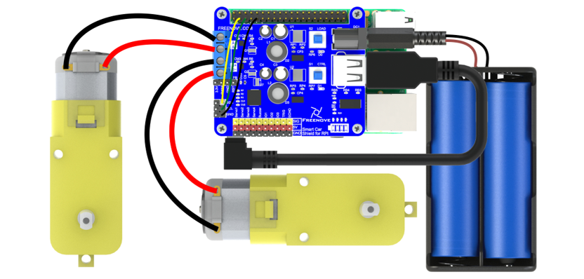

:red:`Caution: Do not remove the cable tie from the motor; otherwise, the motor cable may become detached.`

Type the following command, then the motor will rotate back and forth. Then the program will be terminated and the motor will stop running.. (Note: Here are two commands. Please execute commands in order.)

If the path is already ~/Freenove_Three-wheeled_Smart_Car_Kit_for_Raspberry_Pi/Server, you don’t need to enter the first command.

.. code-block:: console
    
    $ cd ~/Freenove_Three-wheeled_Smart_Car_Kit_for_Raspberry_Pi/Server
    $ python mDev.py motor

RGBLED Module
=========================

Connect pin R, G, B of RGBLEG Module to port IO1, IO2, IO3 of the Shield respectively. Connect “+” to 3.3V of RPi.

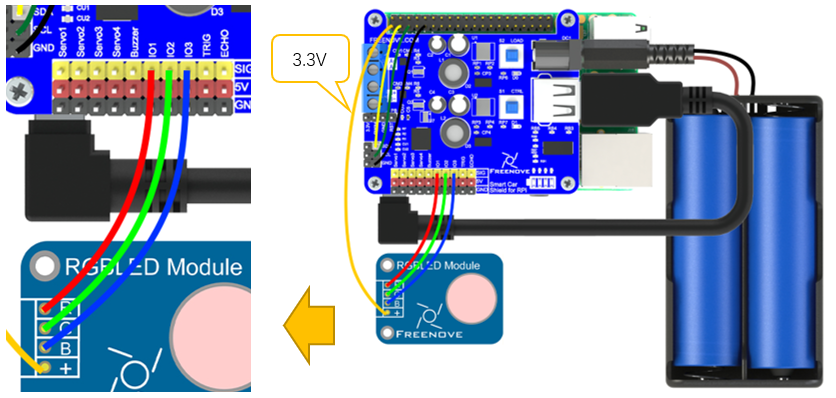

Type the following command, RGBLED will emit red, green, and blue light several times circularly. Then the program exits, the RGBLED is turned off. (Note: Here are two commands. Please execute commands in order.)

.. code-block:: console
    
    $ cd ~/Freenove_Three-wheeled_Smart_Car_Kit_for_Raspberry_Pi/Server
    $ python mDev.py RGBLED

Ultrasonic Module
======================

Connect pin VCC, GND, TRIG, ECHO of Ultrasonic Module to port 5V, GND, TRIG, ECHO of the Shield respectively:

Type the following command to print out the ultrasonic measurement data in the terminal. 

:red:`(Note: Here are two commands. Please execute commands in order.)`

.. code-block:: console
    
    $ cd ~/Freenove_Three-wheeled_Smart_Car_Kit_for_Raspberry_Pi/Server
    $ python mDev.py ultrasonic