##############################################################################
Chapter Smart video car
##############################################################################

If you have any concerns, please feel free to contact us via support@freenove.com

First, let|s make a smart video car.

Assembly
**********************************

Pan-tilt
=============================

Assemble servo2
----------------------------

+-------------------------------------+------------------+
| 1.Assemble the following components | After assembling |
|                                     |                  |
| |Chapter01_00|                      | |Chapter01_01|   |
+-------------------------------------+------------------+
| 2.Assemble the following components | After assembling |
|                                     |                  |
| |Chapter01_02|                      | |Chapter01_03|   |
+-------------------------------------+------------------+

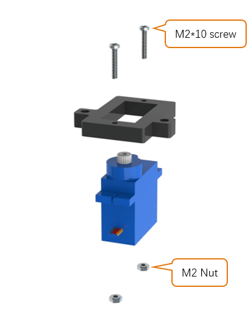
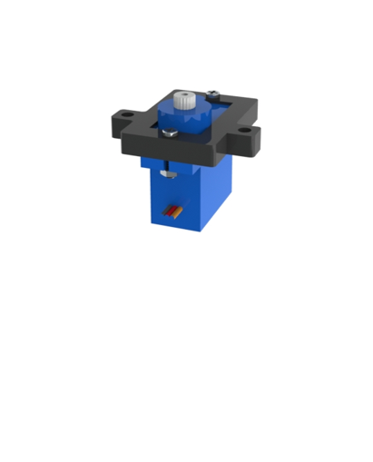
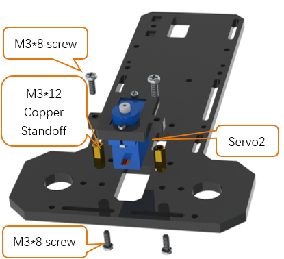
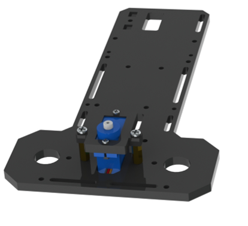

Assemble RGBLED Module and Passive Buzzer Module
-----------------------------------------------------

+--------------------------------------------------+
| Assemble RGBLED Module and Passive Buzzer Module |
|                                                  |
| |Chapter01_04|                                   |
+--------------------------------------------------+
| After assembling                                 |
|                                                  |
| |Chapter01_05|                                   |
+--------------------------------------------------+

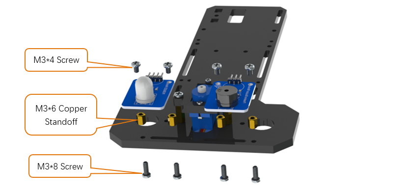
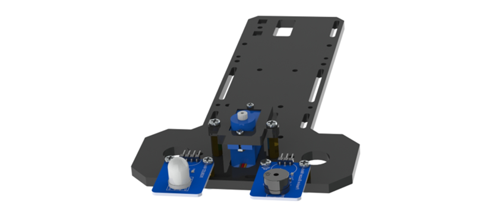

Assemble servo3 support
--------------------------------

+-------------------------------------+--------------------------------------+
| Assemble the following components   | After assembling                     |
|                                     |                                      |
| |Chapter01_06|                      | |Chapter01_07|                       |
+-------------------------------------+--------------------------------------+
| Assemble the following components   | After assembling                     |
|                                     |                                      |
| |Chapter01_08|                      | |Chapter01_09|                       |
+-------------------------------------+--------------------------------------+
| Keep the servo2 rotating to 90 degrees.                                    |
|                                                                            |
| If the drection is changed before installation,                            |
|                                                                            |
| please make it rotate to the 90 degrees with the previous method.          |
|                                                                            |
| Complete the installation according to the direction below.                |
|                                                                            |
| |Chapter01_10|                                                             |
+----------------------------------------------------------------------------+
| After correct assembly, the bracket can rotate 90 degrees to left or right.|
|                                                                            |
| |Chapter01_11|                                                             |
+----------------------------------------------------------------------------+

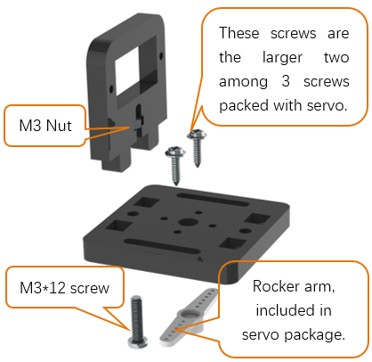
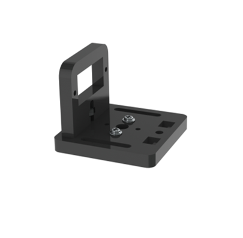
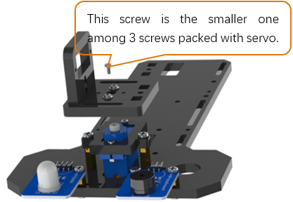
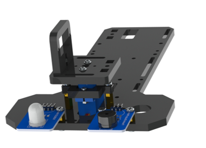
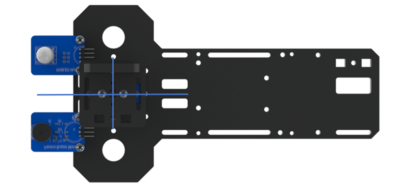
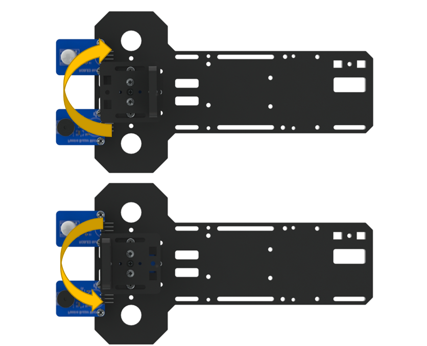

Assemble servo3
-----------------------------

+-------------------------------------+------------------+
| 1.Assemble the following components | After assembling |
|                                     |                  |
| |Chapter01_12|                      | |Chapter01_13|   |
+-------------------------------------+------------------+

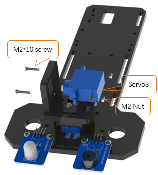
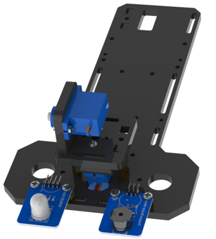

Assemble camera support
------------------------------

+-------------------------------------+--------------------------------------+
| Assemble the following components   | After assembling                     |
|                                     |                                      |
| |Chapter01_14|                      | |Chapter01_15|                       |
+-------------------------------------+--------------------------------------+
| Assemble the following components   | After assembling                     |
|                                     |                                      |
| |Chapter01_16|                      | |Chapter01_17|                       |
+-------------------------------------+--------------------------------------+
| Keep the servo2 rotating to 90 degrees.                                    |
|                                                                            |
| If the drection is changed before installation,                            |
|                                                                            |
| please make it rotate to the 90 degrees with the previous method.          |
|                                                                            |
| Complete the installation according to the direction below.                |
|                                                                            |
| |Chapter01_18|                                                             |
+----------------------------------------------------------------------------+
| After the correct assembly, the support can rotate up to 90 degrees,       |
|                                                                            |
| as shown below.                                                            |
|                                                                            |
| |Chapter01_19|                                                             |
+----------------------------------------------------------------------------+

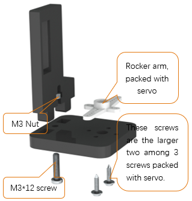
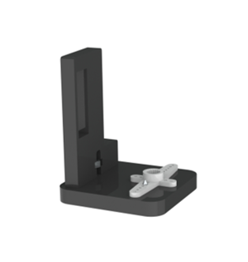
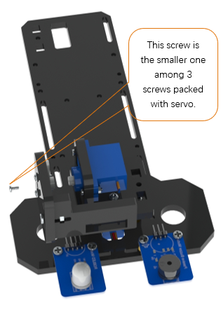
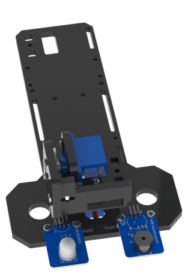
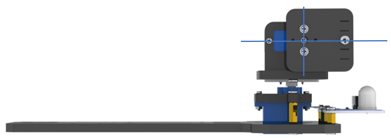
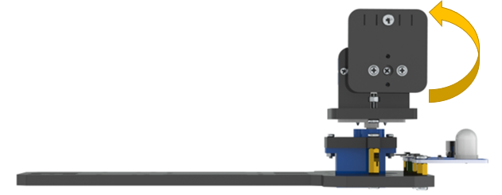

Car body
============================

Driving wheel and motor
------------------------------

+------------------------------------------------------------------------------------+
| Assemble RGBLED Module and Passive Buzzer Module                                   |
|                                                                                    |
| |Chapter01_20|                                                                     |
|                                                                                    |
| :red:`Caution: Do not remove the cable tie from the motor;`                        |
|                                                                                    |
| :red:` otherwise, the motor cable may become detached.`                            |
+------------------------------------------------------------------------------------+
| After assembling                                                                   |
|                                                                                    |
| |Chapter01_21|                                                                     |
+-------------------------------------+----------------------------------------------+
| 2.Install the wheel(Left)           | After assembling                             |
|                                     |                                              |
| |Chapter01_22|                      | |Chapter01_23|                               |
+-------------------------------------+----------------------------------------------+
| 3.Assemble RGBLED Module and Passive Buzzer Module                                 |
|                                                                                    |
| |Chapter01_24|                                                                     |
+------------------------------------------------------------------------------------+
| After assembling                                                                   |
|                                                                                    |
| |Chapter01_25|                                                                     |
+-------------------------------------+----------------------------------------------+
| 4.Install the wheel(Right)          | After assembling                             |
|                                     |                                              |
| |Chapter01_26|                      | |Chapter01_27|                               |
+-------------------------------------+----------------------------------------------+
| After finishing the previous installing, you'll get two parts as follows:          |
|                                                                                    |
| |Chapter01_28|                                                                     |
+------------------------------------------------------------------------------------+

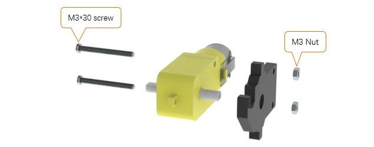

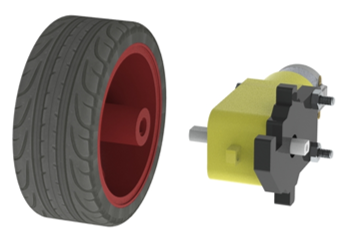
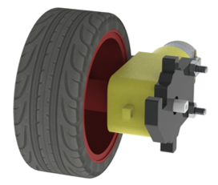
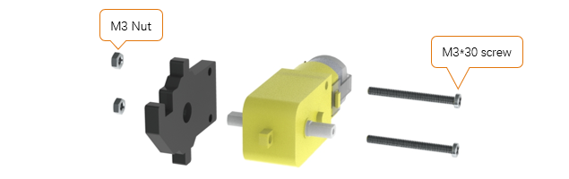

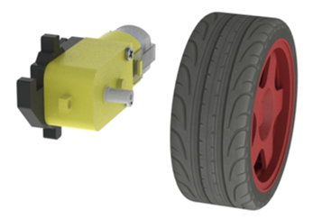
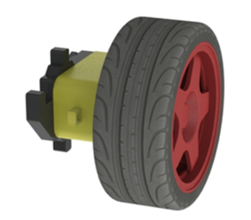
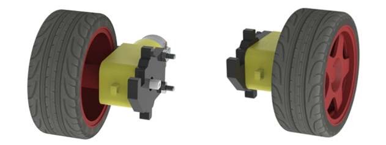

Assemble servo1
-------------------------------------

+-------------------------------------+------------------+
| Assemble the following components   | After assembling |
|                                     |                  |
| |Chapter01_29|                      | |Chapter01_30|   |
+-------------------------------------+------------------+

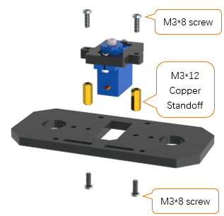
.. |Chapter01_30| image:: ../_static/imgs/1_Smart_video_car/Chapter01_30.png

Assemble Copper Standoff
-------------------------------------

+-------------------------------------+------------------+
| Assemble the following components   | After assembling |
|                                     |                  |
| |Chapter01_31|                      | |Chapter01_32|   |
+-------------------------------------+------------------+

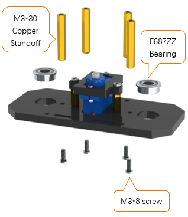
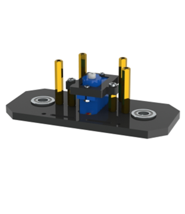

Assemble Direction stick
-------------------------------------

+---------------------------------------------------------------+
| Assemble the following components                             |
|                                                               |
| |Chapter01_33|                                                |
+---------------------------------------------------------------+
| After assembling                                              |
|                                                               |
| |Chapter01_34|                                                |
+---------------------------------------------------------------+
| Pay attention not to tighten the screw, otherwise the acrylic |
|                                                               |
| plate can't move freely.                                      |
|                                                               |
| |Chapter01_35|                                                |
+---------------------------------------------------------------+

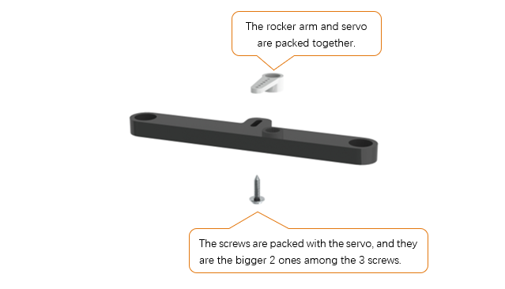

Assembly car head
------------------------------

+---------------------------------------------------------------------------------------+
| Assemble the following components                                                     |
|                                                                                       |
| The rocker arm should be installed in the middle position between its rotation range. |
|                                                                                       |
| A little deviation is acceptable. If it is not installed in the middle position,      |
|                                                                                       |
| you should remove the rocker arm and install it again instead of turning the shaft.   |
|                                                                                       |
| |Chapter01_36|                                                                        |
+---------------------------------------------------------------------------------------+
| After assembling                                                                      |
|                                                                                       |
| |Chapter01_37|                                                                        |
+---------------------------------------------------------------------------------------+
| Keep the servo1 rotating to 90 degrees.                                               |
|                                                                                       |
| If the drection is changed before installation,                                       |
|                                                                                       |
| please make it rotate to the 90 degrees with the previous method.                     |
|                                                                                       |
| Complete the installation according to the direction below.                           |
|                                                                                       |
| |Chapter01_38|                                                                        |
+---------------------------------------------------------------------------------------+
| Assemble the following components                                                     |
|                                                                                       |
| |Chapter01_39|                                                                        |
+---------------------------------------------------------------------------------------+
| After assembling                                                                      |
|                                                                                       |
| |Chapter01_40|                                                                        |
+---------------------------------------------------------------------------------------+
| The two wheels can turn left and right                                                |
|                                                                                       |
| |Chapter01_41|                                                                        |
+---------------------------------------------------------------------------------------+

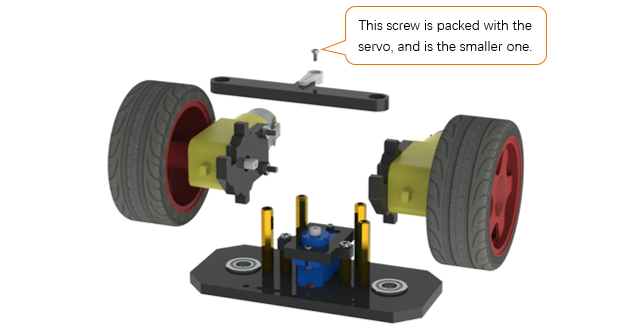
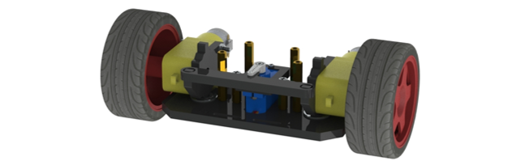
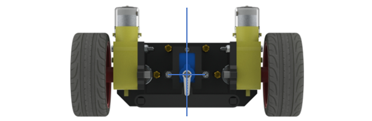
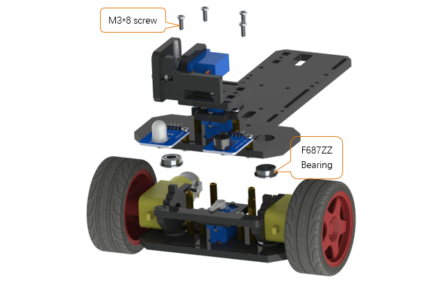
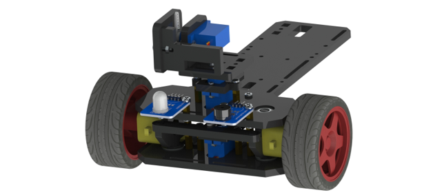
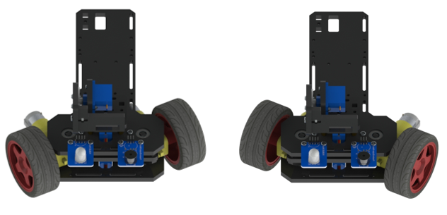

Assemble driven wheel
----------------------------------

+---------------------------------------------------------------------------------------+
| Assemble the following components                                                     |
|                                                                                       |
| |Chapter01_42|                                                                        |
+---------------------------------------------------------------------------------------+
| After assembling                                                                      |
|                                                                                       |
| |Chapter01_43|                                                                        |
+---------------------------------------------------------------------------------------+
| Assemble the following components                                                     |
|                                                                                       |
| |Chapter01_44|                                                                        |
+---------------------------------------------------------------------------------------+
| After assembling                                                                      |
|                                                                                       |
| |Chapter01_45|                                                                        |
+---------------------------------------------------------------------------------------+

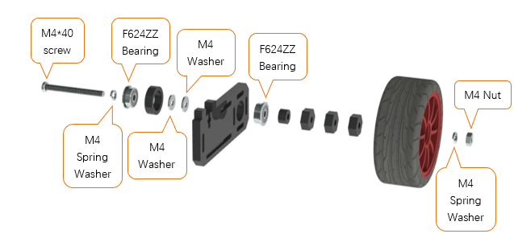

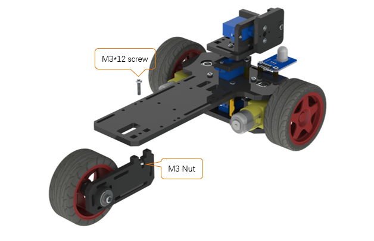
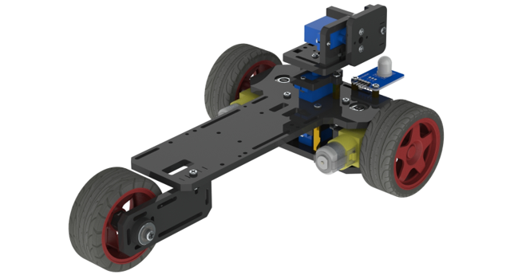

Electronic device
================================

Assemble battery box
-------------------------------

+---------------------------------------------------------------------------------------+
| Assemble the following components                                                     |
|                                                                                       |
| |Chapter01_78|                                                                        |
+---------------------------------------------------------------------------------------+
| After assembling                                                                      |
|                                                                                       |
| |Chapter01_79|                                                                        |
+---------------------------------------------------------------------------------------+

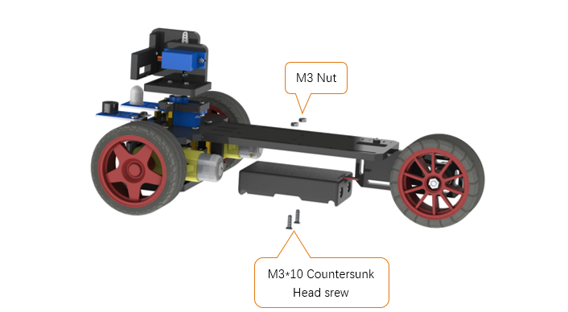
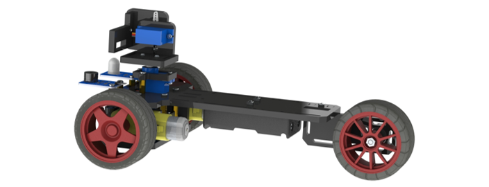

RPi and camera
----------------------------------

+---------------------------------------------------------------------------------------+
| Assemble the following components                                                     |
|                                                                                       |
| |Chapter01_46|                                                                        |
+---------------------------------------------------------------------------------------+
| After assembly                                                                        |
|                                                                                       |
| |Chapter01_47|                                                                        |
+---------------------------------------------------------------------------------------+

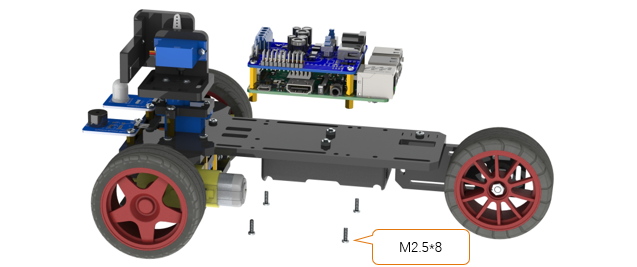
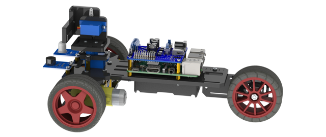

+-------------------------------------------------------------------------------------------------+
| :red:`Connection: please refer to Charpter 0,` :ref:`Step 0.5 test <0.5_test>`.                 |
|                                                                                                 |
| Servo1, Servo2, Servo3 are connected to Servo1, Servo2, Servo3 port of the Shield respectively. |
|                                                                                                 |
| RGBLED Module, Buzzer Module, and other loads are connected to the Shield in the same connection|
|                                                                                                 |
| mode with front "test" section.                                                                 |
|                                                                                                 |
| The motor is connected as below, in which, if you find motor steering error, exchange connection|
|                                                                                                 |
| of two lines to Shield. The camera is connected to any USB port on the RPi. Using the matching  |
|                                                                                                 |
| Micro USB Cable to connect Shield USB port with RPi power supply port.                          |
|                                                                                                 |
| Assemble two 18650 batteries in the battery box, and connect the interface of battery box       |
|                                                                                                 |
| to DC power jack of the Shiel                                                                   |
|                                                                                                 |
| |Chapter01_48|                                                                                  |
+-------------------------------------------------------------------------------------------------+
  
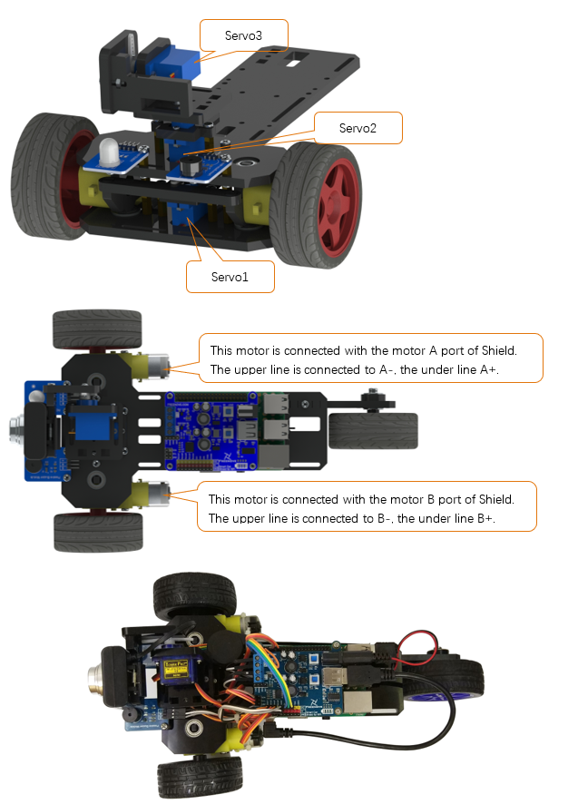

Open the server
******************************

Server with GUI
===============================

Open the switch S1 and S2 on the Shield. After the RPi starts, use the remote desktop to connect RPi. Then open the terminal, and execute the following command to open the server.  (Note: Here are two commands. Please execute  commands in order.)

.. code-block::console

    $ cd ~/Freenove_Three-wheeled_Smart_Car_Kit_for_Raspberry_Pi/Server 
    $ python Main.py

Later, the following window interface appears. Click on the two buttons in the window to open the camera service and TCP communication service, respectively.

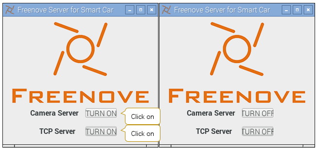

If the terminal shows information below, it indicates that the camera service and TCP communication service have been opened.

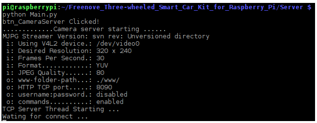

When you want to close them, first click on two TURN OFF button to close the services, and then click on the close button on the top right corner of the window to terminate the program.

Server without GUI
================================

If you do not like the windowed server, you can open the camera and TCP communication services directly through the commands. Open the switch S1 and S2 on the Shield. After the RPi starts, use the remote desktop connect RPi. Then open the terminal and execute the following command. (Note: Here are two commands. Please execute  commands in order.)

.. code-block:: console

    $ cd ~/Freenove_Three-wheeled_Smart_Car_Kit_for_Raspberry_Pi/Server 
    $ python Main.py -mnt

or

.. code-block:: console

    $ cd ~/Freenove_Three-wheeled_Smart_Car_Kit_for_Raspberry_Pi/Server
    $ python Main.py -m -t -n

Parameter “-m” is mjpg-streamer, which means to open the camera service. “-t” means to open the tcp service. “-n” means not to use the visual window interface.

Later, if the following contents appears, it indicates that the camera and tcp services have been opened.

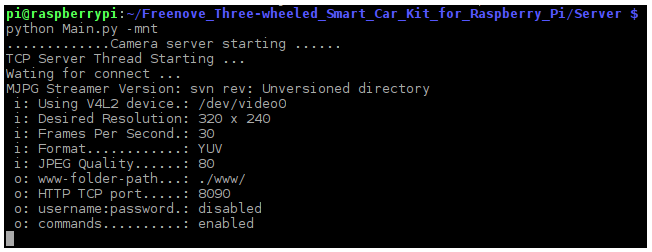

Press twice Ctrl-C or Ctrl-\\ to terminate the program.

Open the client
*********************************

The client can run under any operating system in which Python3 and PyQt5 is installed. For example, Windows OS，Linux OS.

Client under Raspberry Pi (and other GUI supported Linux OS)

Using python to execute code Client.py. Type following commands to open the client. (Note: Here are two commands. Please execute them in order.)

.. code-block:: console

    $ cd ~/Freenove_Three-wheeled_Smart_Car_Kit_for_Raspberry_Pi/Client
    $ python main.py

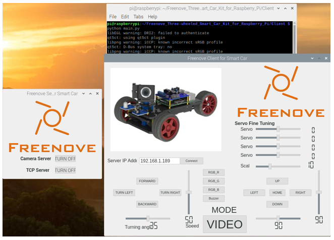

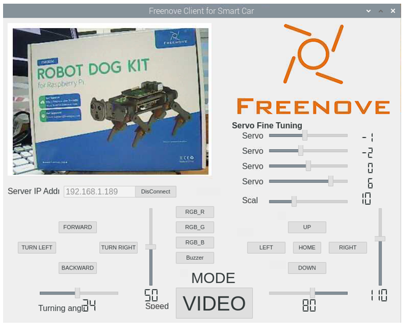

You can refer to :ref:`Control method <Control_method>` section for details.

.. _Control_method:

Client under Windows OS 
================================

If you want to run the client on windows, you need install the program and service according to the following steps.

Install python3.7
--------------------------------

The windows client can only work under Python before Python 3.7.4 now, because some libraries don’t support latest Python now. So it is recommended to install Python 3.7.4 to run the client. 

Download the installation file via link below:

https://www.python.org/downloads/release/python-374/

On the page bottom, choose “Windows x86 executable installer”

Choose ”Windows x86 executable installer” to download and install.

Select “Add Python 3.7 to PATH”. And choose Customize installation.

Select all options and click Next.

Here python is installed into D disk as an example (You can choose your own installation path). Click Install.

Wait for installation.

Now python installation is successful.

Install PyQt5
----------------------------

Press “Win+R” to open Run and type cmd to open windows terminal. Type following commands one by one, four in total. 

.. code-block:: console

    $ python -m pip install --upgrade pip
    $ pip3 install PyQt5==5.13.0
    $ pip3 install PyQtWebKit
    $ pip3 install pyqt5-tools

After installation is successful, type command below to check.

.. code-block:: console

    $ pip3 list

.. image:: ../_static/imgs/1_Smart_video_car/Chapter01_61.png
    :align: center

Download the code under windows. Unzip it and place it in the D disk root directory. You can also place it into other disks (like E), but the path in following command should be modified accordingly (replace D: by E:). Click on the link below to download the file directly. You need to delete "-master" to rename the unzipped file to "Freenove_Three-wheeled_Smart_Car_Kit_for_Raspberry_Pi".

https://github.com/Freenove/Freenove_Three-wheeled_Smart_Car_Kit_for_Raspberry_Pi/archive/master.zip 

Press WIN+R, and type cmd to open the command line window. Then type the following command to open the client. 

:red:`(Note: Here are three commands. Please execute commands in order.)`

.. code-block:: console

    $ D:
    $ cd \Freenove_Three-wheeled_Smart_Car_Kit_for_Raspberry_Pi\Client\python main.py

Or enter path “D:\\Freenove_Three_wheeled_Smart_Car_for_Raspberry_Pi\\Client\\” and run main.py with Python3 IDLE. Then the following window interface appears.

In the edit box Server IP Address, input IP address of video car RPi and click Connect. Make sure that server of your RPi have been opened already, and the switch S1 and S2 on the Shield have been opened.

After the connection is successful, you can control the video car.

Control method
==================================

Besides using the mouse to click on the button in the window to control the video car, you can also use the highlight keys of keyboard to control the video car, as shown below.

The following is the corresponding action of Button/Key.

+------------+-------------+----------------------------+
|   Button   |     Key     |           Action           |
+============+=============+============================+
| FORWARD    | W           | Move                       |
+------------+-------------+----------------------------+
| BACKWARD   | S           | Back off                   |
+------------+-------------+----------------------------+
| TURN LEFT  | A           | Turn left                  |
+------------+-------------+----------------------------+
| TURN RIGHT | D           | Turn right                 |
+------------+-------------+----------------------------+
| LEFT       | left arrow  | Turn camera left           |
+------------+-------------+----------------------------+
| RIGHT      | right arrow | Turn camera right          |
+------------+-------------+----------------------------+
| UP         | up arrow    | Turn camera up             |
+------------+-------------+----------------------------+
| DOWN       | down arrow  | Turn camera down           |
+------------+-------------+----------------------------+
| HOME       | H           | Turn camera back Home      |
+------------+-------------+----------------------------+
| RGB_R      | R           | On/off red LED of RGBLED   |
+------------+-------------+----------------------------+
| RGB_G      | G           | On/off green LED of RGBLED |
+------------+-------------+----------------------------+
| RGB_B      | B           | On/off blue LED of RGBLED  |
+------------+-------------+----------------------------+
| Buzzer     | V           | On/off Buzzer              |
+------------+-------------+----------------------------+

The function of the SiliderBar with name in the window is shown below.

+----------------------------+----------------------------------------------------------+
|         SliderBar          |                         Function                         |
+============================+==========================================================+
| Speed                      | Control the forward / backward speed of the car.         |
+----------------------------+----------------------------------------------------------+
| Turning angle              | Control turning angle.                                   |
+----------------------------+----------------------------------------------------------+
| Scale                      | The minimum angle of each rotation of the camera.        |
+----------------------------+----------------------------------------------------------+
| Servo Fine Turning 1,2,3,4 | Servo1,2,3,4 is for angle fine tuning settings.          |
|                            |                                                          |
|                            | If the servo is not completely centered in installation, |
|                            |                                                          |
|                            | you can make a fine tuning by the SliderBar              |
+----------------------------+----------------------------------------------------------+

Other control:

+-----------------------------+------------------------------+
|           Control           |           Function           |
+=============================+==============================+
| Edit box Server IP Address  | IP address of Server         |
+-----------------------------+------------------------------+
| Button “Connect/DisConnect” | Connect or DisConnect Server |
+-----------------------------+------------------------------+
| Mode Button                 | Switch to Video/Radar Mode   |
+-----------------------------+------------------------------+

Servo Reversed
==============================

Note:

When you run client to control servos, if some servo direction is reversed. You need modify mTCPServer.py file. Under following path in your Raspberry Pi.

**Freenove_Three-wheeled_Smart_Car_Kit_for_Raspberry_Pi/Server/mTCPServer.py**

When a servo is reversed, just modify corresponding False to True.

.. code-block:: python
    :linenos:

    #####################################################
    #If your servo rotation is inverted, please set the corresponding value to True
    servo1_reversed = False        # True or False
    servo2_reversed = False        # True or False
    servo3_reversed = False        # True or False
    #####################################################

For example, servo1 rotation is reversed, modify the code.

.. code-block:: python
    :linenos:

    #####################################################
    #If your servo rotation is inverted, please set the corresponding value to True
    servo1_reversed = False        # True or False
    servo2_reversed = False        # True or False
    servo3_reversed = False        # True or False
    #####################################################

**Then save the modification.**

Automatic Start
*********************************

After you understand how the video car works, the server can be set to start automatically once Raspberry Pi is turned on. So when you start Raspberry Pi, you can directly connect the car to client, without opening and configuring the server remotely. There are many ways to set automatic start. Here we introduce a simple and easy way.

Configuration for automatic start
=========================================

The file "Raspberry PiCar.desktop" under "Server" directory is the start configuration file of Server program. The name of it shown in file manager is "RaspberryPiCar". First, use following command to see if the file is executable.

.. code-block:: console
    
    $ ls -l | grep ”RaspberryPi”

.. image:: ../_static/imgs/1_Smart_video_car/Chapter01_65.png
    :align: center

As shown above, if the file is not executable, use following command to add executable permissions.

.. code-block:: console
    
    $ chmod +x RaspberryPiCar.desktop

If you haven't changed the file "Raspberry PiCar.desktop" name or path, you don't need to modify. Otherwise you must modify it to your own path. Open the file with file editor. Exec = XXX indicates that the command xxx which will be executed. Make sure that the command and path are correct. 

.. code-block:: console
    
    $ geany RaspberryPiCar.desktop

Finally, we will guide you to copy the file "Raspberry PiCar.desktop" to directory "/home/pi/.config/autostart/". If the directory does not exist, the directory need to be created first. 

Check if directory exists.

.. code-block:: console
    
    $ ls ~/.config/

If the directory does not exist, create it by using following command. If the directory exists, skip the command.

.. code-block:: console
    
    $ mkdir ~/.config/autostart/

Use following command to copy the file "RaspberryPiCar.desktop" to folder "autostart".

.. code-block:: console
    
    $ cp RaspberryPiCar.desktop ~/.config/autostart

Execute the "RaspberryPiCar.desktop" in folder "autostart" to test whether it is workable.

.. code-block:: console
    
    $ sudo ~/.config/autostart/RaspberryPiCar.desktop

The above results show that the Server program has been successfully started. Then restart your raspberry pi to test whether automatic start is successfully.

.. code-block:: console
    
    $ sudo reboot

After restarting, you can connect raspberry pi with client. You can check whether the Server terminal works normal with the following commands.

.. code-block:: console
    
    $ ps aux | grep -E "./mjpg_streamer|Main.py"

Exit Server program
=======================================

Executing the program CloseServer.sh under Server can terminate the Server program.

.. code-block:: console
    
    $ cd ~/Freenove_Three-wheeled_Smart_Car_Kit_for_Raspberry_Pi/Server
    $ sh CloseServer.sh

Cancel automatic start
=======================================

If you don't need automatic start for the Server program, just use following command to delete the file "~/.config/autostart/RaspberryPiCar.desktop".

.. code-block:: console
    
    $ rm -f ~/.config/autostart/RaspberryPiCar.desktop

Android and iOS app
***********************************

We provide an android app for this kit. You can use Android phone or tablet to control the car.

First, please install Freenove APP for your Android device. You can install the app in any of the following ways:

- View or download on Google Play:

    https://play.google.com/store/apps/details?id=com.freenove.suhayl.Freenove

- Download APK file directly:

    https://github.com/Freenove/Freenove_App_for_Android/raw/master/freenove.apk

For more app details, please visit link below:

https://github.com/Freenove/Freenove_App_for_Android/

You can download and install the Freenove iPhone ios app by searching freenove in app store.

After the installation is completed, open the Freenove APP and select “Smart Car for Raspberry Pi”. As shown below:

First, make sure your raspberry pi has been connected to WIFI.

Then execute command ifconfg to get wireless IP under wlan0.

Make sure camera and TCP services of the RPi have been opened. Then enter your RPi IP address in the column Server IP Address, click the button CONNECT. Then the connection succeeds later. RPi IP address is 192.168.1.108. after a successful connection, the interface is shown below.

The IP address will be stored after correct connection, so that it can be used multiple times without having to output the IP address every time. Then you can control the car.