##############################################################################
Chapter Ultrasonic Radar Car
##############################################################################

If you have any concerns, please feel free to contact us via support@freenove.com

Assembly
***************************************

On the basis of the front video car, remove the camera, camera support, servo3, and servo3 support. Then assemble the support for Ultrasonic Module.

Replace pan-tilt
=====================================

Remove camera part
-------------------------------------

+-------------------------+-----------------------+
| Remove camera           | Remove camera support |
|                         |                       |
| |Chapter02_00|          | |Chapter02_01|        |
+-------------------------+-----------------------+
| Remove servo3           | Remove servo3 support |
|                         |                       |
| |Chapter02_02|          | |Chapter02_03|        |
+-------------------------+-----------------------+
| Separate Servo3 support                         |
|                                                 |
| |Chapter02_04|                                  |
+-------------------------------------------------+

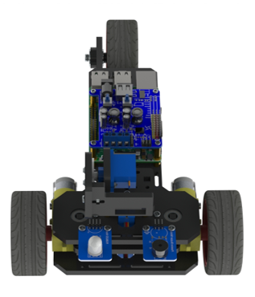
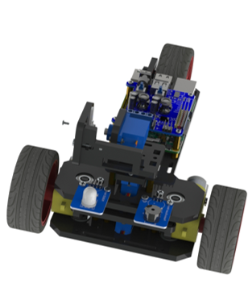
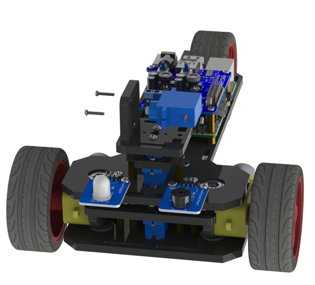
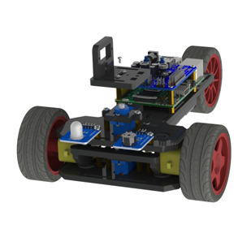
.. |Chapter02_04| image:: ../_static/imgs/2_Ultrasonic_Radar_Car/Chapter02_04.png

Assembly ultrasonic module support
-----------------------------------------

+-------------------------------------+------------------+
|  Assemble the following components  | After assembling |
|                                     |                  |
| |Chapter02_05|                      | |Chapter02_06|   |
+-------------------------------------+------------------+
|  Assemble the following components                     |
|                                                        |
| |Chapter02_07|                                         |
+--------------------------------------------------------+
|  After assembling                                      |
|                                                        |
| |Chapter02_08|                                         |
+--------------------------------------------------------+
| Keep the servo2 rotating to 90 degrees.                |
|                                                        |
| If the drection is changed before installation,        |
|                                                        |
| please make it rotate to the 90 degrees with the       |
|                                                        |
| previous method. Complete the installation according   |
|                                                        |
| to the direction below.                                |
|                                                        |
| |Chapter02_09|                                         |
+--------------------------------------------------------+

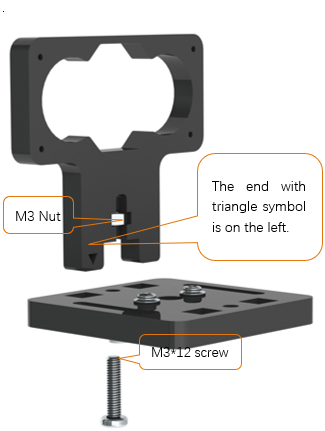
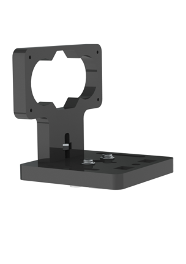
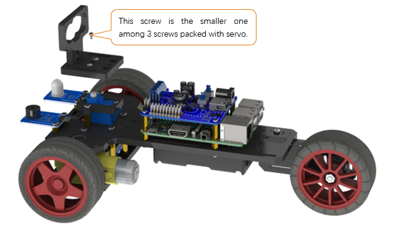
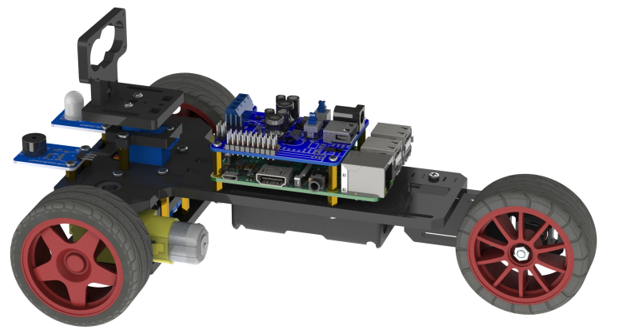
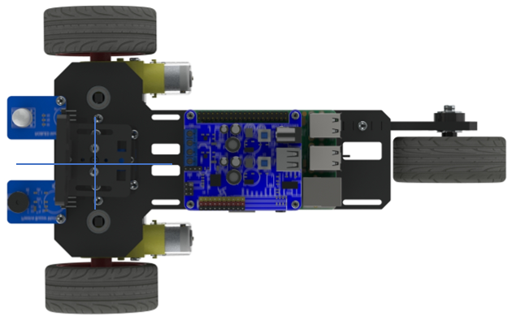

Ultrasonic Module
---------------------------------------

+-----------------------------------------------------------------------------+
| Use M-M Jumper to connect the Ultrasonic Module with the Shield.            |
|                                                                             |
| And then use TWO M1.4 * 6 tapping screws to assemble the Ultrasonic Module. |
|                                                                             |
| As follows:                                                                 |
|                                                                             |
| |Chapter02_10|                                                              |
+-----------------------------------------------------------------------------+
| After assembling                                                            |
|                                                                             |
| |Chapter02_11|                                                              |
+-----------------------------------------------------------------------------+

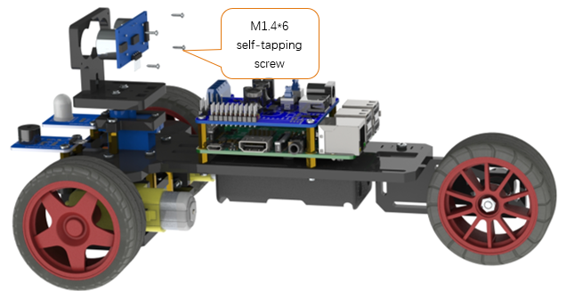
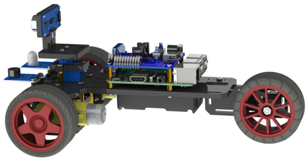

+--------------------------------------------------------------------------------------------+
| :red:`Connection:  please refer to Charpter 0, Step 0.5 test.`                             |
|                                                                                            |
| Connection mode between Shield and Ultrasonic Module, is the same as front "Test" section. |
|                                                                                            |
| Connection mode between other devices and Shield is the same with front “Smart video car”. |
|                                                                                            |
| |Chapter02_12|                                                                             |
+--------------------------------------------------------------------------------------------+

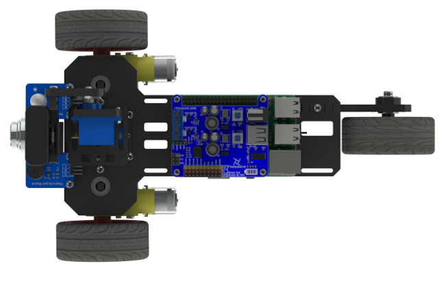

Open the server
***********************************

The method of opening the server is the same as the video car. Since there is no Camera device now, please do not open the Camera Server in the server window or use the “-m” command option.

GUI server
===================================

Open the switch S1 and S2 on the Shield. After the RPi starts, use the remote desktop to connect RPi. Then open the terminal, and execute the following command to open the server. (Note: Here are two commands. Please execute  commands in order.)

.. code-block:: console
    
    $ cd ~/Freenove_Three-wheeled_Smart_Car_Kit_for_Raspberry_Pi/Server 
    $ python Main.py

Later, the following window interface appears. Click on the corresponding button of TCP Server to open TCP communication Server.

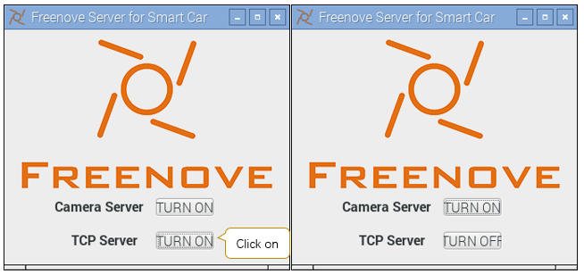

If the terminal shows information below, it indicates that the camera service and TCP communication service have been opened.

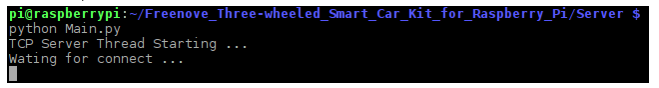

When you want to close them, first click on two TURN OFF button to close the services, and then click on the close button on the top right corner of the window to terminate the program.

Server in command line mode
=====================================

Type the following command to open the TCP service. 

:red:`(Note: Here are two commands. Please execute  commands in order.)`

.. code-block:: console
    
    $ cd ~/Freenove_Three-wheeled_Smart_Car_Kit_for_Raspberry_Pi/Server 
    $ python Main.py -nt

or

.. code-block:: console
    
    $ cd ~/Freenove_Three-wheeled_Smart_Car_Kit_for_Raspberry_Pi/Server
    $ python Main.py  -t -n

Parameter “-t” is means to open the tcp service. “-n” means not to use the visual window interface.

Later, if the following contents appears, it indicates that the tcp service has been opened.

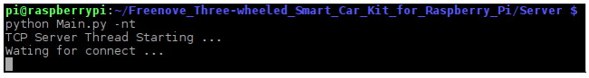

Press Ctrl-C or Ctrl-\\ to terminate the program.

Open the client
The way to open the client is the same as “Smart video car” 

Client under Raspberry Pi (including other GUI supported Linux OS)
Using python to execute code Client.py. Type following commands to open the client. (Note: Here are two commands. Please execute them in order.)

.. code-block:: console
    
    $ cd ~/Freenove_Three-wheeled_Smart_Car_Kit_for_Raspberry_Pi /Client
    $ python main.py

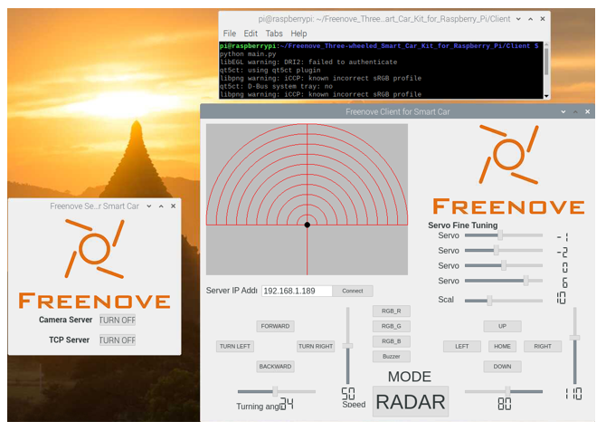

Client under Windows OS
==================================

Press WIN+R, and type cmd to open the command line window. Then type the following command to open the client. (Note: Here are three commands. Please execute  commands in order.)

.. code-block:: console
    
    $ D:
    $ cd \Freenove_Three-wheeled_Smart_Car_Kit_for_Raspberry_Pi\Client\python main.py

Or enter path “D:\\Freenove_Three_wheeled_Smart_Car_for_Raspberry_Pi\\Client\\” and double-click main.py with open way of Python3.exe. Then the following window interface appears.

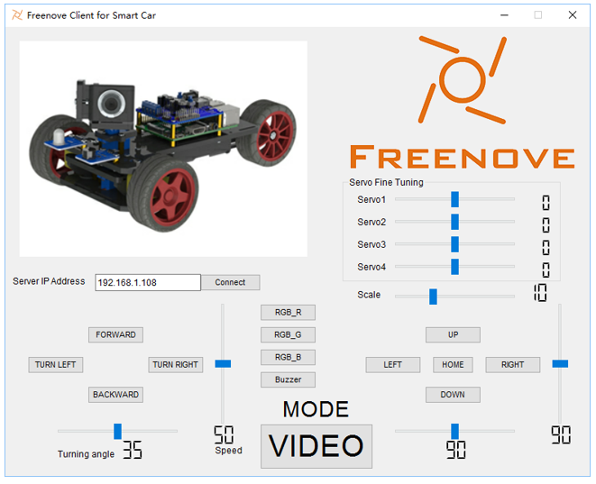

In the edit box Server IP Address, input IP address of your RPi and click Connect. Make sure that server of your RPi have been opened already, and the switch S1 and Shield S2 have also been opened. 

Then click on the MODE Button, the model will be switched to RADAR. Then the car enters ultrasonic radar mode, and constantly scan the distance, and the results will be displayed in the window. In this process, you can still control the car to move, and control the RGBLED module or Passive Buzzer module on the car. 

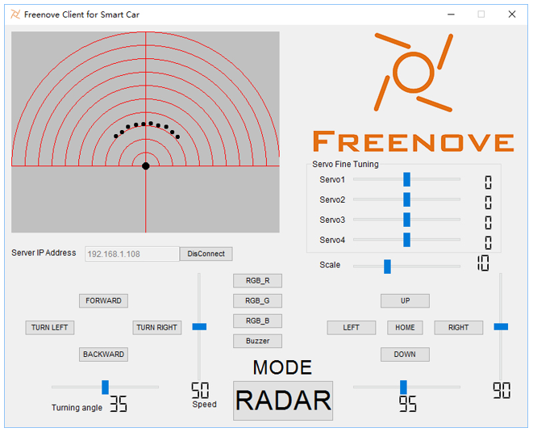