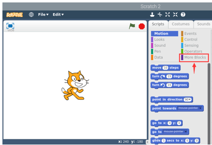
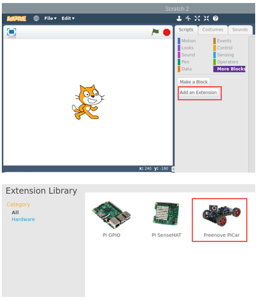
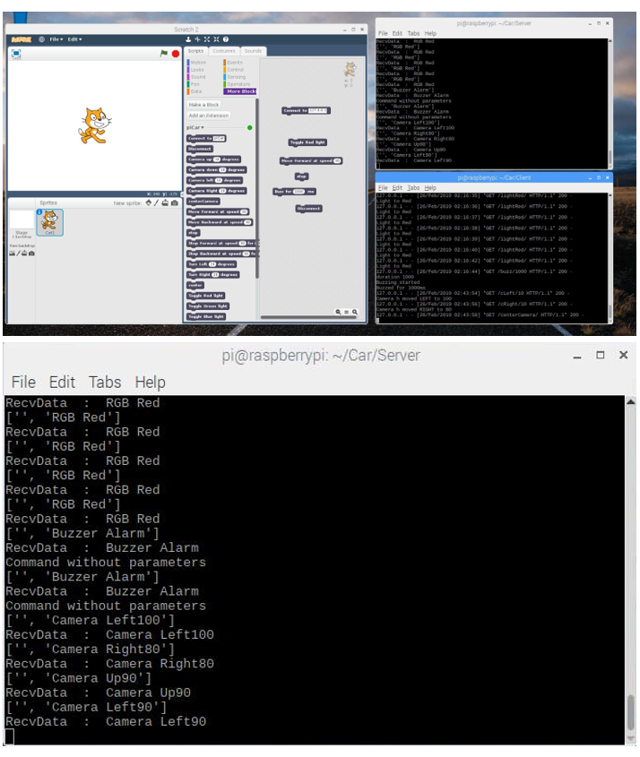
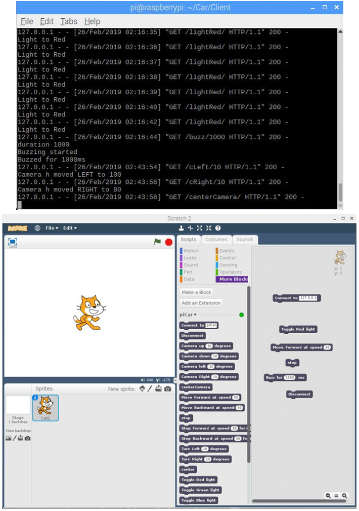

##############################################################################
Chapter Contributions of other developers
##############################################################################

If you have any concerns, please feel free to contact us via support@freenove.com

We are very grateful to all developers for their contributions to this product. We are very welcome and highly praised for such work. We will include the excellent contents from developers in main branch of this tutorial.

Extensions for Scratch 2
**********************************

This is an extension for Scratch2, with which you can operate this car on Scratch2.

Author: Ruairi

How to use?
===================================

How to install the extension into Scratch 2:

1: cd into Freenove_Three-wheeled_Smart_Car_Kit_for_Raspberry_Pi 

.. code-block:: console
    
    $ cd ~/Freenove_Three-wheeled_Smart_Car_Kit_for_Raspberry_Pi

2: Run the following commands:

.. code-block:: console
    
    $ sudo cp ./Client/Scratch/piCar.js /usr/lib/scratch2/scratch_extensions
    $ sudo cp ./Client/html/imgs/car_photo.jpg /usr/lib/scratch2/medialibrarythumbnails

3: NOTE: **only run the following command after you have successfully executed commands above**

.. code-block:: console
    
    $ sudo cp ./Client/Scratch/extensions.json /usr/lib/scratch2/scratch_extensions

4: cd into the Client folder and run the following command:

.. code-block:: console
    
    $ cd ~/Freenove_Three-wheeled_Smart_Car_Kit_for_Raspberry_Pi/Client
    $ python ScratchServer.py

5: Run Scratch 2 and select More Blocks->Add an Extension->Freenove PiCar (double click it to add)

6: To use the blocks, always remember to run the "connect to" block first and finish off with a disconnect block.

If you don't disconnect, you may not be able to connect to your car from another app (e.g. the android app) Enjoy!

Screenshot of running
=============================

