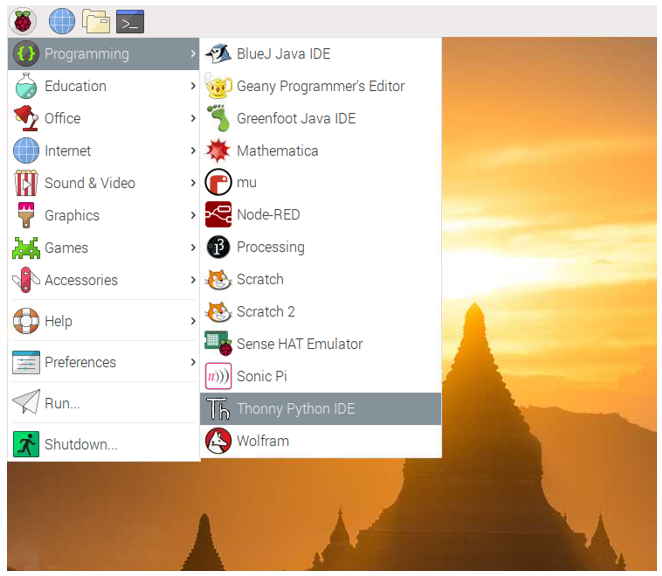
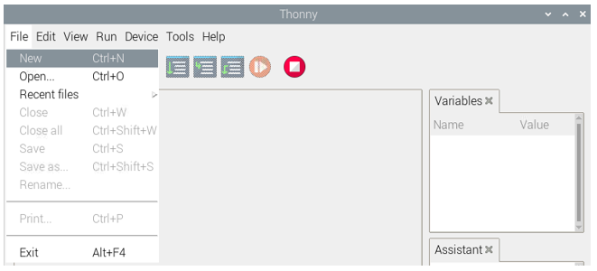
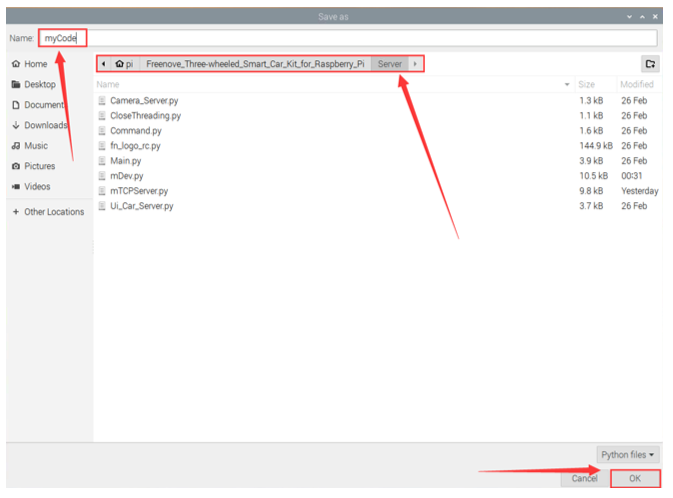
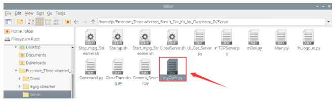
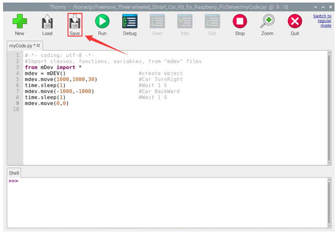
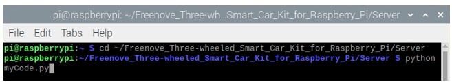

##############################################################################
Chapter Free your innovation 
##############################################################################

If you have any concerns, please feel free to contact us via support@freenove.com

If you want to write your own program to control this car, you can follow this chapter.

The car program is based on python3. If your default python is python2, please set python3 as default python.

If you have never learned python before, you can learn some basics through the following link:

https://python.swaroopch.com/basics.html

Program
**********************************

First, open Thonny Python IDE. Thonny is a software easy to use for beginners.

Create a new file.

Name the file “myCode” as an example. And save it in Server folder of the car code in Raspberry Pi.

**Freenove_Three-wheeled_Smart_Car_Kit_for_Raspberry_Pi/Server**

Open the Server folder of the car code. You will see the code you created.

Write your own code in myCode.py like below as an example. Then save as below: 

Type following commands to enter folder of myCode.py.

.. code-block:: console
    
    $ cd ~/Freenove_Three-wheeled_Smart_Car_Kit_for_Raspberry_Pi/Server

Run myCode.py

.. code-block:: console
    
    $ python myCode.py

Result:

The car will turn right with 30° for 1s. Then move back for 1s. Then stop.

Code Example
*****************************

Motor 
============================

Motor 

.. code-block:: python
    :linenos:

    #-*- coding: utf-8 -*-
    #Import classes, functions, variables, from "mdev" files
    from mDev import *
    mdev = mDEV()                       #create object
    mdev.move(1000,1000,30)             #Car TurnRight
    time.sleep(1)                       #Wait 1 S
    mdev.move(-1000,-1000)              #Car BackWard
    time.sleep(1)                       #Wait 1 S
    mdev.move(0,0)

Ultrasonic module

.. code-block:: python
    :linenos:

    #-*- coding: utf-8 -*-
    #Import classes, functions, variables, from "mdev" files
    from mDev import *
    mdev = mDEV()                       #create object
    #Obtain the distance from the obstacle in front to the ultrasound
    distance=mdev.getSonic()
    print("Sonic: %.2f cm"%distance)    #Print once

Buzzer

.. code-block:: python
    :linenos:

    #-*- coding: utf-8 -*-
    #Import classes, functions, variables, from "mdev" files
    from mDev import *
    mdev = mDEV()                       #create object
    #Buzzer sounds for 2 seconds
    mdev.setBuzzer(2000)
    time.sleep(2)                       #Wait 2 S
    mdev.setBuzzer(0)

Led

.. code-block:: python
    :linenos:

    #-*- coding: utf-8 -*-
    #Import classes, functions, variables, from "mdev" files
    from mDev import *
    mdev = mDEV()                       #create object
    #The order of LED lighting is red-green-blue-white
    mdev.setLed(1,0,0)
    time.sleep(1)                       #Wait 1 S               
    mdev.setLed(0,1,0)
    time.sleep(1)
    mdev.setLed(0,0,1)
    time.sleep(1)
    mdev.setLed(1,1,1)
    time.sleep(1)
    mdev.setLed(0,0,0)

Servo

.. code-block:: python
    :linenos:

    #-*- coding: utf-8 -*-
    #Import classes, functions, variables, from "mdev" files
    from mDev import *
    mdev = mDEV()                       #create object
    #The servo2  rotates back and forth between 40 and 140 degrees
    while True:
        for i in range(40,140,1):
            mdev.setServo('2',i)
            time.sleep(0.005)
        for i in range(140,40,-1):
            mdev.setServo('2',i)
            time.sleep(0.005)

Related Functions
****************************

The functions listed below are included the "mDev.py" file. If you want to see more detailed code content, please open the mDev.py file to check.

+-----------------------+----------------------------------------------------------------------------------------------------------+
|       Function        |                                               Description                                                |
+=======================+==========================================================================================================+
| move(left_pwm,        | This function is used to control the movement of the car and has three input parameters.                 |
|                       |                                                                                                          |
| right_pwm,            | The first parameter is "left_pwm". Control the PWM of the left wheel of the car.                         |
|                       |                                                                                                          |
| steering_angle)       | The range is -1000~1000. The positive value makes the wheels rotates positively,                         |
|                       |                                                                                                          |
|                       | and the negative value make the wheels reverse. The larger the absolute value of the number,             |
|                       |                                                                                                          |
|                       | the faster the speed.                                                                                    |
|                       |                                                                                                          |
|                       | The second parameter is "right_pwm". Control the PWM of the right wheel of the tricycle,                 |
|                       |                                                                                                          |
|                       | the range is -1000~1000. The positive value makes the wheels rotates positively, and the negative        |
|                       |                                                                                                          |
|                       | value make the wheels reverse. The larger the absolute value of the number, the faster the speed.        |
|                       |                                                                                                          |
|                       | The third parameter is "steering_angle". Controls the turning angle of the car, the range is 0~180.      |
|                       |                                                                                                          |
|                       | The default is 90 degrees and keep the car going straight.                                               |
+-----------------------+----------------------------------------------------------------------------------------------------------+
| getSonic()            | Returns the distance from the obstacle in front to the ultrasonic module, unit CM.                       |
|                       |                                                                                                          |
| setBuzzer(pwm)        | This function is used to control the buzzer and has one input parameter.                                 |
|                       |                                                                                                          |
|                       | The parameter "pwm" controls the PWM signal output by the buzzer, the range is 0-65535.                  |
|                       |                                                                                                          |
|                       | The larger the "pwm", the lager the tone.                                                                |
+-----------------------+----------------------------------------------------------------------------------------------------------+
| setLed(R,G,B)         | This function is used to control the color of Led. It has three input parameters.                        |
|                       |                                                                                                          |
|                       | When the parameter "R" is 1, the red channel of the Led is on. When it is 0, the red channel is off.     |
|                       |                                                                                                          |
|                       | When the parameter "G" is 1, the green channel of the Led is on. When it is 0, the green channel is off. |
|                       |                                                                                                          |
|                       | When the parameter "B" is 1, the blue channel of the Led is on. When it is 0, the blue channel is off.   |
+-----------------------+----------------------------------------------------------------------------------------------------------+
| setServo(index,angle) | This function is used to control the servo and has two input parameters.                                 |
|                       |                                                                                                          |
|                       | The first parameter "index" selects the servo number to be controlled, which are "1", "2", "3", "4".     |
|                       |                                                                                                          |
|                       | The second parameter "angle" sets the angle of the servo, the range is 0~180°.                           |
+-----------------------+----------------------------------------------------------------------------------------------------------+