##############################################################################
List
##############################################################################

**If you have any concerns, please feel free to contact us via** support@freenove.com

Acrylic Sheet
******************************

+----------+----------+
| |List00| | |List01| |
+----------+----------+

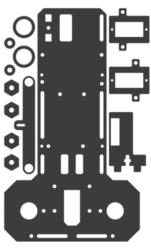
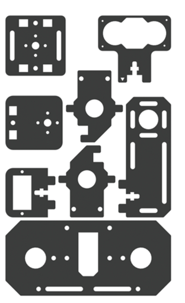

Surface of the acrylic sheet is covered with a layer of protective film. You need to remove it first before using.

Some holes of the acrylic sheets may have residues, so you may need to clean them before using.

Machinery Parts
*******************************

In addition to bearing F624ZZ and F687ZZ, the number of each following part provided is more than required.

.. list-table:: 
   :width: 100%
   :align: center

   * -  |List02|
     -  |List03|
     -  |List04|

   * -  |List05|
     -  |List06|
     -  |List07|

   * -  |List08|
     -  |List09|
     -  |List10|

   * -  |List11|
     -  |List12|
     -  |List13|

   * -  |List14|
     -  |List15|
     -  |List16|

   * -  |List17|
     -  |List18|
     -  |List19|

   * -  |List20|
     -  |List21|
     -  |List22|

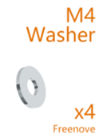
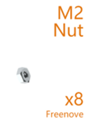
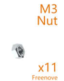
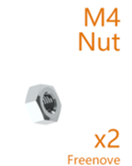
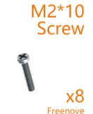
.. |List07| image:: ../_static/imgs/List/List07.png
.. |List08| image:: ../_static/imgs/List/List08.png
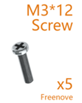
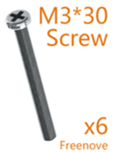
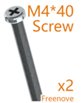

.. |List15| image:: ../_static/imgs/List/List15.png
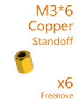
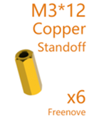
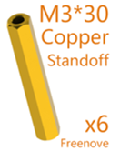
.. |List19| image:: ../_static/imgs/List/List19.png
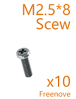
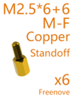
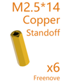

Transmission Parts
******************************

.. list-table:: 
   :width: 100%
   :align: center

   * -  Servo x3
     -  Driven wheel x1

   * -  |List23|
     -  |List24|

   * -  DC speed reduction motor x2
     -  Driving wheel x2

   * -  |List25|
        
        :red:`Caution:Do not remove the cable tie from the motor;` 

        :red:`otherwise, the motor cable may become detached.`
     -  |List26|

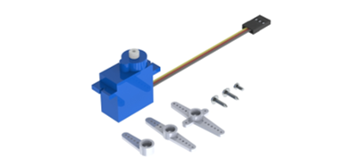
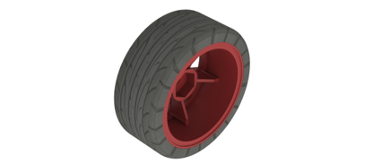
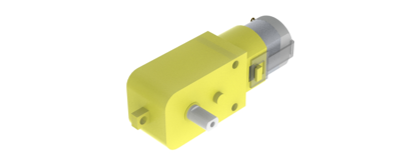
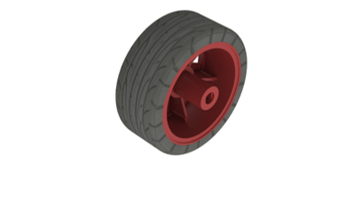

Electronic Parts
********************************

+---------------------------+-------------------------+------------------------------+
| Freenove Smart Car Shield | Freenove Passive Buzzer | Freenove RGB LED             |
|                           |                         |                              |
| for RPi x1                | Module x1               | Module x1                    |
|                           |                         |                              |
| |List27|                  | |List28|                | |List29|                     |
+---------------------------+-------------------------+------------------------------+
| 18650x2 Battery Holder x1 | USB Camera x1           | HC-SR04 Ultrasonic Module x1 |
|                           |                         |                              |
| |List30|                  | |List31|                | |List32|                     |
+---------------------------+-------------------------+------------------------------+
| Micro USB Cable x1                                                                 |
|                                                                                    |
| |List33|                                                                           |
+------------------------------------------------------------------------------------+
| Type-C USB Cable x1                                                                |
|                                                                                    |
| |List34|                                                                           |
+------------------------------------------------------------------------------------+
| Jumper Wire M/M x10                                                                |
|                                                                                    |
| |List35|                                                                           |
+------------------------------------------------------------------------------------+

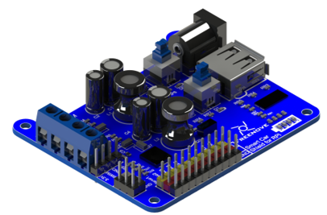
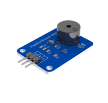
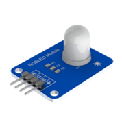
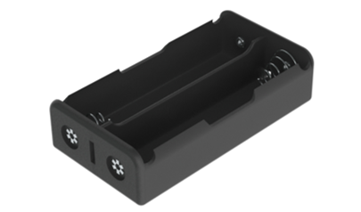
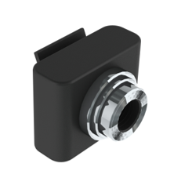
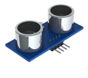

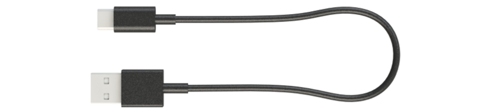

Tools
********************************

+----------------------+------------------------+----------------------------+
| Cross screwdriver x1 | Slotted screwdriver x1 | Multifunctional Spanner x1 |
|                      |                        |                            |
| |List36|             | |List37|               | |List38|                   |
+----------------------+------------------------+----------------------------+

Self-prepared Parts
********************************

+---------------------------------------------------------------------------------+
| Two 18650 lithium batteries without protection board,                           |
|                                                                                 |
| with continuous discharge current > 3A.                                         |
|                                                                                 |
| It would be easier to find proper battery on eBay by search “18650 high drain”. |
|                                                                                 |
| |List39|                                                                        |
+---------------------------------------------------------------------------------+
| Raspberry Pi ( :red:`Recommended model: Raspberry 4B / 3B+ / 3B` ) x1           |
|                                                                                 |
| |List40|                                                                        |
+---------------------------------------------------------------------------------+

.. |List40| image:: ../_static/imgs/List/List40.png