##############################################################################
Preface
##############################################################################

Welcome to use Freenove Three-wheeled Smart Car Kit for Raspberry Pi. Whether you are a senior maker, or have little technical knowledge, by using this tutorial, you can make a very cool smart car with video surveillance and ultrasonic radar.

This kit is based on the popular control panel Pi Raspberry, so you can share and exchange your experience and design ideas with many enthusiasts all over the world. The parts in this kit include all electronic components, modules, and mechanical components required for making the smart car. And all of them are packaged individually. There are detailed assembly and commissioning instructions in this book. And if you encounter any problem, you can always look for fast and free technical support through support@freenove.com to ensure that your smart car is successfully assembled and run.

The contents in this book can ensure enthusiastic with little technical knowledge to make the smart car. If you are very interested in Raspberry Pi, and want to learn how to program and build the circuit, please visit our website www.freenove.com or contact us to buy the kits designed for beginners: 

Freenove Basic\\LCD1602\\Super\\Ultrasonic\\RFID\\Ultimate Starter Kit for Raspberry Pi

Raspberry Pi
******************************

Raspberry Pi (called RPi, RPI, RasPi, the text these words will be used alternately behind), a micro computer with size of a card, quickly swept the world since its debut. It is widely used in desktop workstation, media center, smart home, robots, and even the servers, etc. It can do almost anything, which continues to attract fans to explore it. Raspberry Pi used to be running in Linux system and along with the release of windows 10 IoT, we can also run it in Windows. Raspberry Pi (with interfaces for USB, network, HDMI, camera, audio, display and GPIO), as a microcomputer, can be running in command line mode and desktop system mode. Additionally, it is easy to operate just like Arduino, and you can even directly operate the GPIO of CPU. 

So far, Raspberry Pi has developed to the fourth generation. Changes in versions are accompanied by increase and upgrades in hardware. A type and B type, the first generation of products, have been stopped due to various reasons. Other versions are popular and active and the most important is that they are consistent in the order and number of pins, which makes the compatibility of peripheral devices greatly enhanced between different versions.

Here are some practicality pictures and model diagrams of Raspberry Pi:

.. list-table:: 
   :width: 100%
   :align: center

   * -  Practicality picture of Raspberry Pi 4 Model B:
     -  Model diagram of Raspberry Pi 4 Model B:

   * -  |Preface00|
     -  |Preface01|

   * -  Practicality picture of Raspberry Pi 3 Model B+:
     -  Model diagram of Raspberry Pi 3 Model B+:

   * -  |Preface02|
     -  |Preface03|

   * -  Practicality picture of Raspberry Pi 3 Model B: 
     -  Model diagram of Raspberry Pi 3 Model B:

   * -  |Preface04|
     -  |Preface05|

   * -  Practicality picture of Raspberry Pi 2 Model B:
     -  Model diagram of Raspberry Pi 2 Model B:

   * -  |Preface06|
     -  |Preface07|

   * -  Practicality picture of Raspberry Pi 1 Model B+:
     -  Model diagram of Raspberry Pi 1 Model B+:

   * -  |Preface08|
     -  |Preface09|

   * -  Practicality picture of Raspberry Pi 3 Model A+:
     -  Model diagram of Raspberry Pi 3 Model A+:

   * -  |Preface10|
     -  |Preface11|

   * -  Practicality picture of Raspberry Pi 1 Model A+:
     -  Model diagram of Raspberry Pi 1 Model A+:

   * -  |Preface12|
     -  |Preface13|

   * -  Practicality picture of Raspberry Pi Zero W:
     -  Model diagram of Raspberry Pi Zero W:

   * -  |Preface14|
     -  |Preface15|

   * -  Practicality picture of Raspberry Pi Zero:
     -  Model diagram of Raspberry Pi Zero:

   * -  |Preface16|
     -  |Preface17|

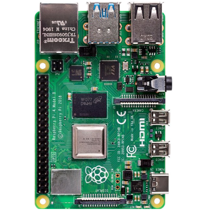
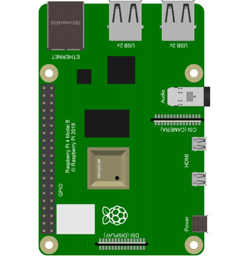
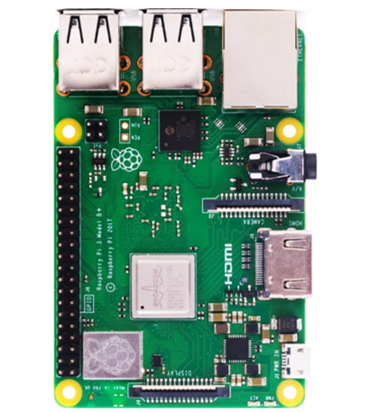
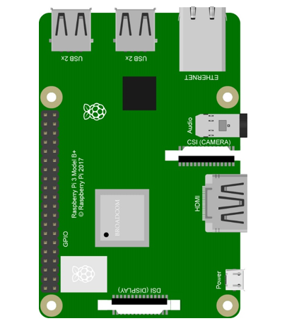
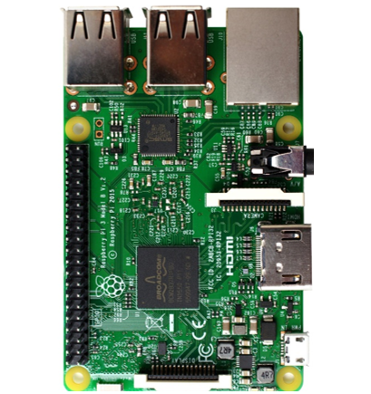
.. |Preface05| image:: ../_static/imgs/Preface/Preface05.png
.. |Preface06| image:: ../_static/imgs/Preface/Preface06.png
.. |Preface07| image:: ../_static/imgs/Preface/Preface07.png
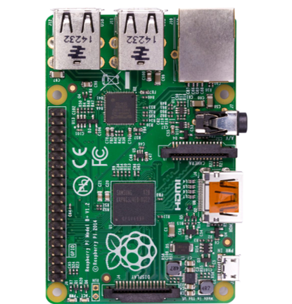
.. |Preface09| image:: ../_static/imgs/Preface/Preface09.png
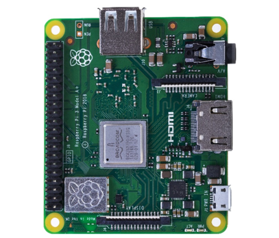
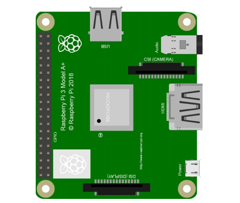
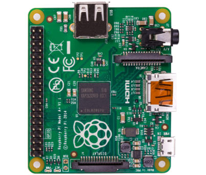
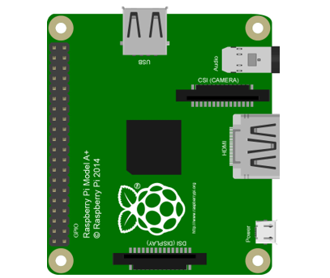
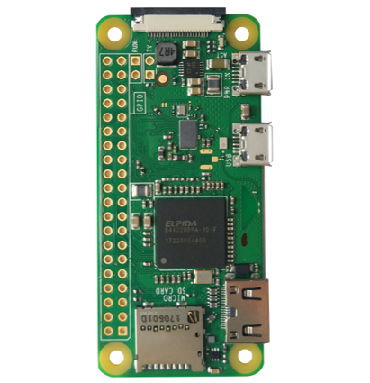
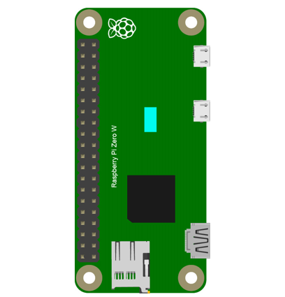
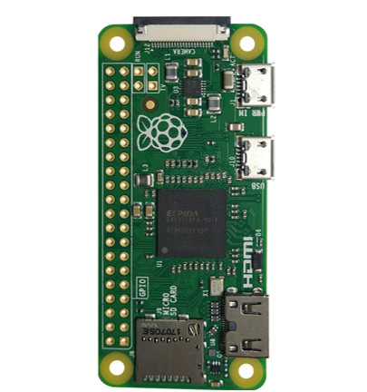
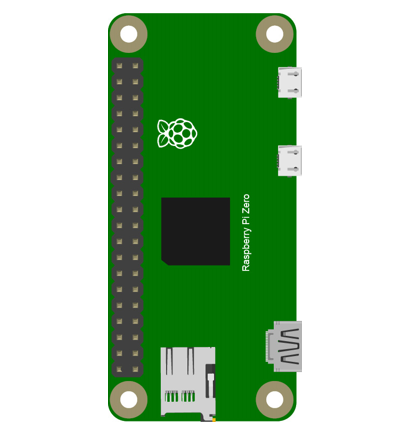

Hardware interface diagram of RPi 4B is shown below:

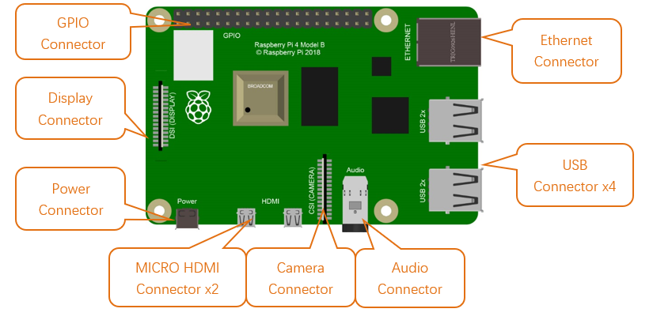

Hardware interface diagram of RPi 3B+/3B/2B/1B+ is shown below:

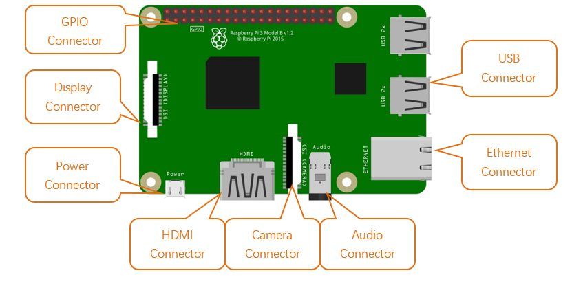

Hardware interface diagram of RPi A+ is shown below:

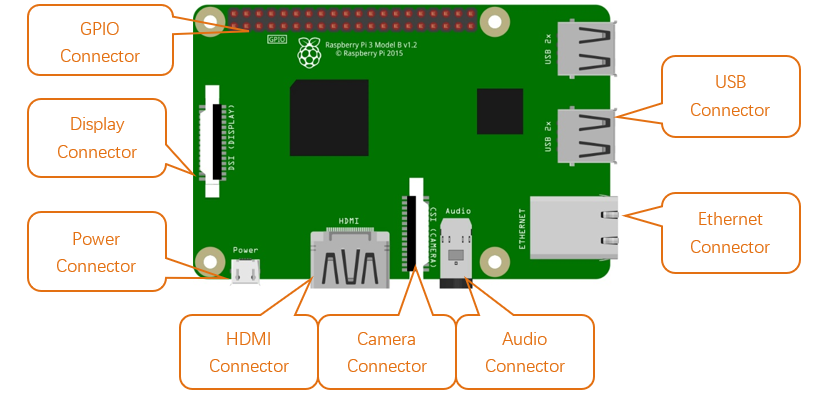

Hardware interface diagram of RPi Zero/Zero W is shown below:

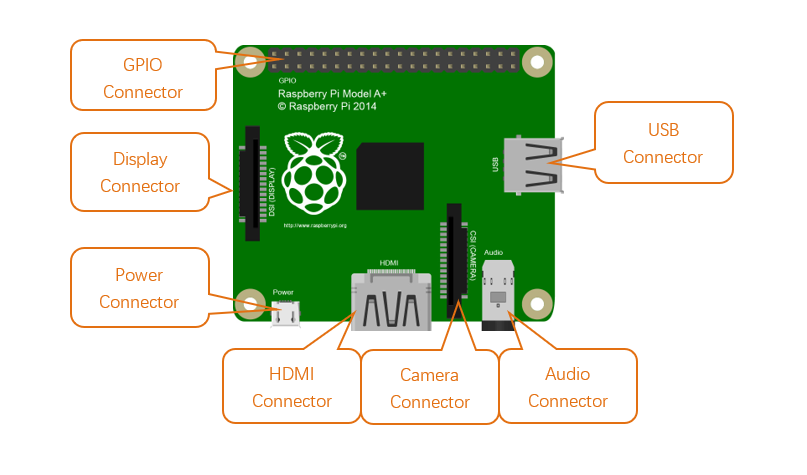

GPIO
=============================

General purpose input/output; in this specific case, the pins on the Raspberry Pi and what you can do with them. So called because you can use them for all sorts of purposes; most can be used as either inputs or outputs, depending on your program.

When programming the GPIO pins there are two different ways to refer to them: GPIO numbering and physical numbering.

BCM GPIO Numbering
------------------------------

Raspberry Pi CPU use BCM2835/BCM2836/BCM2837of Broadcom. GPIO pin number is set by chip manufacturer. These are the GPIO pins as the computer sees them. The numbers don't make any sense to humans, they jump about all over the place, so there is no easy way to remember them. You will need a printed reference or a reference board that fits over the pins.

Each pin is defined as below:

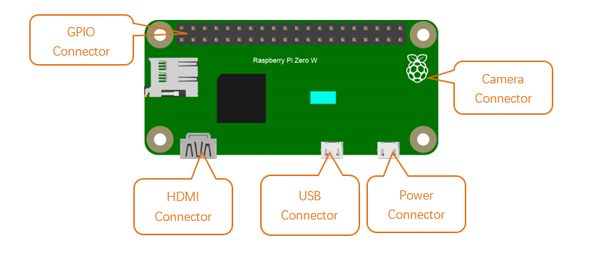

For more details about pin definition of GPIO, please refer to http://pinout.xyz/

PHYSICAL Numbering
------------------------------

The other way to refer to the pins is by simply counting across and down from pin 1 at the top left (nearest to the SD card). This is 'physical numbering' and it looks like this:

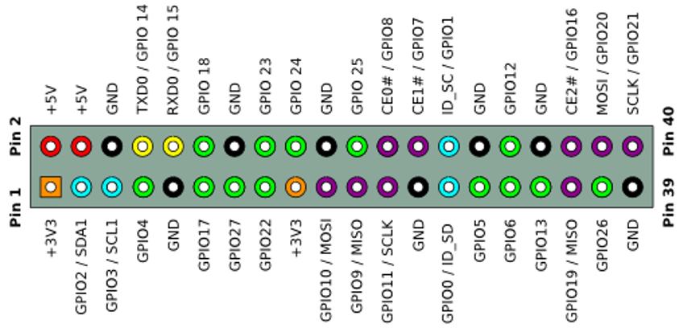