##############################################################################
Preparation
##############################################################################

Install the System
********************************

Firstly, install a system for your RPi.

Component List 
===============================

Required Components
--------------------------------

+----------------------------------------------+------------------------------------------------+
| Raspberry Pi 4B / 3B+/ 3B /3A+ (Recommended) | 5V/3A Power Adapter. Different versions of     |
|                                              |                                                |
|                                              | Raspberry Pi have different power requirements |
|                                              |                                                |
| |Preparation00|                              | |Preparation01|                                |
+----------------------------------------------+------------------------------------------------+
| Micro USB Cable x1                           | Micro SD Card (TF Card) x1, Card Reader x1     |
|                                              |                                                |
| |Preparation02|                              | |Preparation03|                                |
+----------------------------------------------+------------------------------------------------+

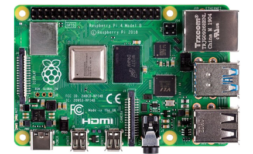
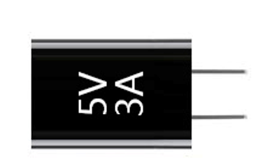
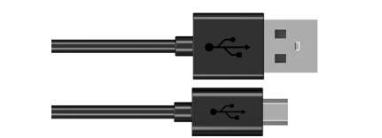
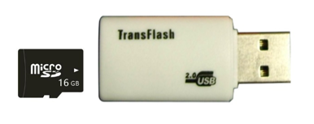

This robot also supports the following versions of the Raspberry Pi, but additional accessories need to be prepared by yourself. 

:red:`In this kit, we highly recommend Raspberry Pi 4B / 3B+ / 3A+ / 3B.`

:red:`Raspberry Pi 2B / B+ is also usable, but an additional USB Wi-Fi module is required.`

:red:`Raspberry Pi A+ / Zero / Zero W are not recommended.`

Power requirement of different versions of Raspberry Pi is shown in following table:

+-------------------------+------------------+-----------------------------+--------------------+
| Product                 | Recommended PSU  | Maximum total USB           | Typical bare-board |
|                         |                  |                             |                    |
|                         | current capacity | peripheral                  | active current     |
|                         |                  |                             |                    |
|                         |                  | current draw                | consumption        |
+=========================+==================+=============================+====================+
| Raspberry Pi Model A    | 700mA            | 500mA                       | 200mA              |
+-------------------------+------------------+-----------------------------+--------------------+
| Raspberry Pi Model B    | 1.2A             | 500mA                       | 500mA              |
+-------------------------+------------------+-----------------------------+--------------------+
| Raspberry Pi Model A+   | 700mA            | 500mA                       | 180mA              |
+-------------------------+------------------+-----------------------------+--------------------+
| Raspberry Pi Model B+   | 1.8A             | 600mA/1.2A (switchable)     | 330mA              |
+-------------------------+------------------+-----------------------------+--------------------+
| Raspberry Pi 2 Model B  | 1.8A             | 600mA/1.2A (switchable)     | 350mA              |
+-------------------------+------------------+-----------------------------+--------------------+
| Raspberry Pi 3 Model B  | 2.5A             | 1.2A                        | 400mA              |
+-------------------------+------------------+-----------------------------+--------------------+
| Raspberry Pi 3 Model A+ | 2.5A             | Limited by PSU, board,      | 350mA              |
|                         |                  |                             |                    |
|                         |                  | and connector               |                    |
|                         |                  |                             |                    |
|                         |                  | ratings only                |                    |
+-------------------------+------------------+-----------------------------+--------------------+
| Raspberry Pi 3 Model B+ | 2.5A             | 1.2A                        | 500mA              |
+-------------------------+------------------+-----------------------------+--------------------+
| Raspberry Pi 4 Model B  | 3.0A             | 1.2A                        | 600mA              |
+-------------------------+------------------+-----------------------------+--------------------+
| Raspberry Pi Zero W     | 1.2A             | Limited by PSU, board,      | 150mA              |
|                         |                  |                             |                    |
|                         |                  | and connector               |                    |
|                         |                  |                             |                    |
|                         |                  | ratings only                |                    |
+-------------------------+------------------+-----------------------------+--------------------+
| Raspberry Pi Zero       | 1.2A             | Limited by PSU, board,      | 100mA              |
|                         |                  |                             |                    |
|                         |                  | and connector               |                    |
|                         |                  |                             |                    |
|                         |                  | ratings only                |                    |
+-------------------------+------------------+-----------------------------+--------------------+

For more details, please refer to https://www.raspberrypi.org/help/faqs/#powerReqs

In addition, RPi also needs a network cable used to connect it to wide area network.

All of these components are necessary. Among them, the power supply is required at least 5V/2.5A, because lack of power supply will lead to many abnormal problems, even damage to your RPi. So power supply with 5V/2.5A is highly recommend. SD Card Micro (recommended capacity 16GB or more) is a hard drive for RPi, which is used to store the system and personal files. In later projects, the components list with a RPi will contains these required components, using only RPi as a representative rather than presenting details.

Optional Components
=================================

Under normal circumstances, there are two ways to login to Raspberry Pi: using independent monitor, or remote desktop to share a monitor with your PC.

Required Accessories for Monitor
---------------------------------------

If you want to use independent monitor, mouse and keyboard, you also need the following accessories.

1.Display with HDMI interface

2.Mouse and Keyboard with USB interface

As to Pi Zero and Pi Zero W, you also need the following accessories.

1.	Micro-HDMI to HDMI converter wire.

2.	Micro-USB to USB-A Receptacles converter wire (Micro USB OTG wire). 

3.	USB HUB.

4.	USB transferring to Ethernet interface or USB Wi-Fi receiver. 

For different Raspberry Pi, the optional items are slightly different. But all of their aims are to convert the special interface to standard interface of standard Raspberry Pi.

+----------------------------------------------------------+------------------------+-------+----------------------+-------+---------------------+-----------+-------------+
|                                                          | Pi Zero                | Pi A+ | Pi Zero W            | Pi 3A+| Pi B+/2B            | Pi 3B/3B+ | Pi 4B       |
+==========================================================+========================+=======+======================+=======+=====================+===========+=============+
| Monitor                                                  | Yes (All)                                                                                                     |
+----------------------------------------------------------+---------------------------------------------------------------------------------------------------------------+
| Mouse                                                    | Yes (All)                                                                                                     |
+----------------------------------------------------------+---------------------------------------------------------------------------------------------------------------+
| Keyboard                                                 | Yes (All)                                                                                                     |
+----------------------------------------------------------+------------------------+-------+----------------------+-------+---------------------+-----------+-------------+
| Micro-HDMI to HDMI Adapter & Cable                       | Yes                    | No    | Yes                  | No    | No                  | No        | No          |
+----------------------------------------------------------+------------------------+-------+----------------------+-------+---------------------+-----------+-------------+
| Micro-HDMI to HDMI Adapter & Cable                       | No                                                                                              | Yes         |
+----------------------------------------------------------+------------------------+-------+----------------------+-----------------------------------------+-------------+
| Micro-USB to USB-A Adapter & Cable (Micro USB OTG Cable) | Yes                    | No    | Yes                  | No                                                    |
+----------------------------------------------------------+------------------------+-------+----------------------+-------+---------------------+-----------+-------------+
| USB HUB                                                  | Yes                    | Yes   | Yes                  | Yes   | No                  | No        | No          |
+----------------------------------------------------------+------------------------+-------+----------------------+-------+---------------------+-----------+-------------+
| USB to Ethernet Interface                                | select one from two or         | optional                     |Internal Integration |Internal Integration     |
+----------------------------------------------------------+                                +------------------------------+---------------------+                         |
| USB Wi-Fi Receiver                                       | select two from two            | Internal Integration         | optional            |                         |
+----------------------------------------------------------+--------------------------------+------------------------------+---------------------+-------------------------+

Required Accessories for Remote Desktop
------------------------------------------------

If you don't have an independent monitor, or you want to use a remote desktop, first you need to login to Raspberry Pi through SSH, then open the VNC or RDP service. So you need the following accessories.

+------------------------------+---------+-----------+-------+--------+----------+--------------+
| Item                         | Pi Zero | Pi Zero W | Pi A+ | Pi 3A+ | Pi B+/2B | Pi 3B/3B+/4B |
+------------------------------+---------+-----------+-------+--------+----------+--------------+
| Micro-USB to USB-A OTG cable | Yes     | Yes       | No    | NO                               |
+------------------------------+---------+-----------+-------+                                  |
| USB transferring             | Yes     | Yes       | Yes   |                                  |
|                              |         |           |       |                                  |
| to Ethernet interface        |         |           |       |                                  |
+------------------------------+---------+-----------+-------+----------------------------------+

Raspberry Pi OS
=================================

Official Method
--------------------------------

It is recommended to use this method.

You can follow the official method to install the system for raspberry pi

https://projects.raspberrypi.org/en/projects/raspberry-pi-setting-up/2

In this way, the system will be download automatically via the application. 

Download system manually (optional)
------------------------------------------

After installing the Imager Tool in link above. You can also download the system manually first. 

Visit RPi official website (https://www.RaspberryPi.org/), click “Downloads” and choose to download “Raspberry Pi OS”. Raspberry Pi OS supported by RPI is an operating system based on Linux, which contains a number of contents required for RPi. We recommended Raspberry Pi OS to beginners. All projects in this tutorial are operated under the Raspberry Pi OS.

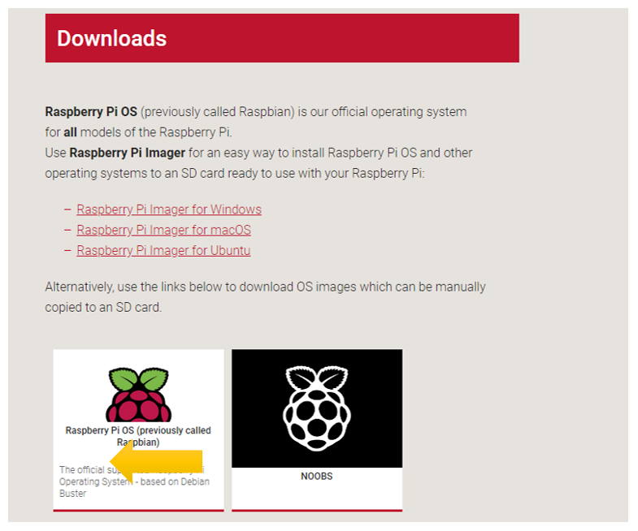

https://www.raspberrypi.org/downloads

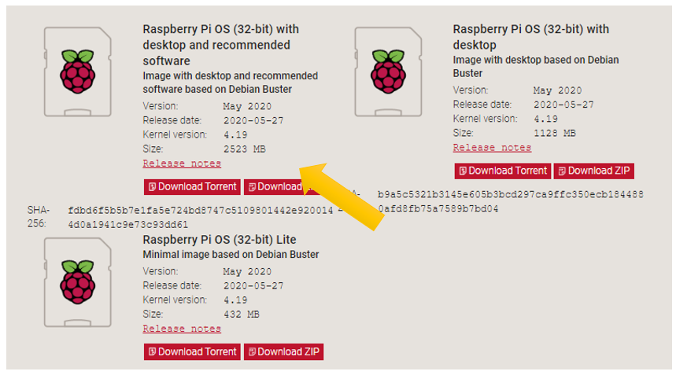

After the zip file is download. 

**Write System to Micro SD Card**

First, put your Micro **SD card** into card reader and connect it to USB port of PC. Then open imager toll, choose 

Choose system that you just download in Use custom.

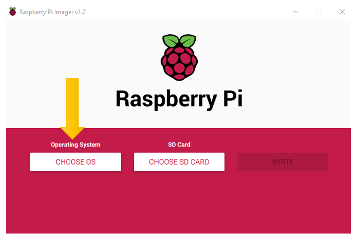

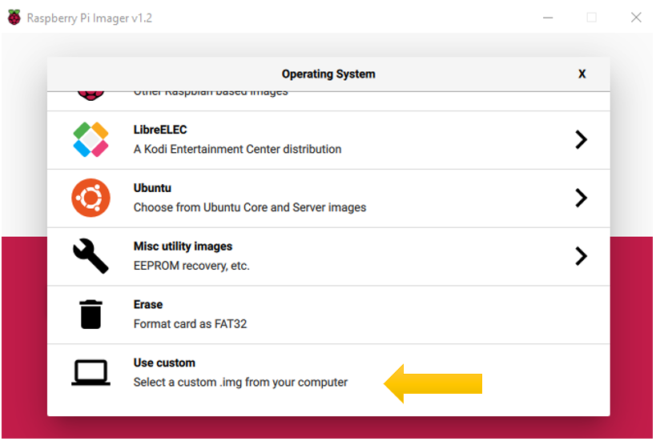

Choose the SD card. Then click “WRITE”.

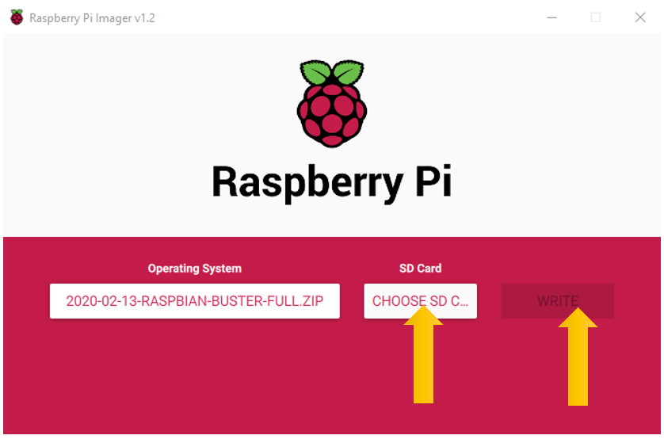

Start Raspberry Pi
-----------------------------

If you don't have a spare monitor, please jumper to next section. If you have a spare monitor, please follow steps in this section. 

After the system is written successfully, take out Micro SD Card and put it into the card slot of RPi. Then connect RPi to screen through the HDMI, to mouse and keyboard through the USB port, to network cable through the network card interface and to the power supply. Then your RPi starts initially. Later, you need to enter the user name and password to login. The default user name: pi; password: raspberry. Enter and login. After login, you can enter the following interface.

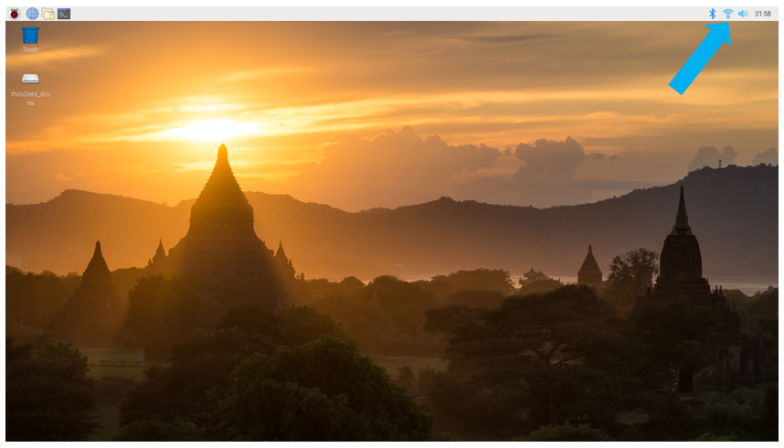

Now, you have successfully installed the Raspberry Pi OS for your RPi.

Then you can connect WiFi on the right corner.

Now you can jumper to :ref:`VNC Viewer`.

Remote desktop & VNC
**********************************

If you don't have a spare display, mouse and keyboard for your RPi, you can use a remote desktop to share a display, keyboard, and mouse with your PC. Below is how to use remote desktop under the Windows operating system to control RPi. 

Under windows, Raspberry Pi can be generally accessed remotely through two applications. The first one is the windows built-in application remote desktop, which corresponds to the Raspberry Pi xrdp service. The second one is the free application VNC Viewer, which corresponds to the VNC interface of Raspberry Pi. Each way has its own advantages. You can choose either one or two.

+---------------------------+--------------+
|          Windows          | Raspberry Pi |
+===========================+==============+
| Remote Desktop Connection | Xrdp         |
+---------------------------+--------------+
| VNC Viewer                | VNC          |
+---------------------------+--------------+

VNC Viewer can not only run under Windows, but also under system MAC, Linux, IOS, Android and so on.

:red:`Some remote connection tools like Xrdp, it does not support opencv and pyqt window display. So it is recommended to use VNC Viewer to connect Raspberry Pi for this robot.`

SSH
=============================

Under previous Raspberry Pi OS, SSH is opened by default. Under the latest version of Raspberry Pi OS, it is closed by default. So you need to open it first.

**Method: after the system is written. Create a folder named “ssh” under generated boot disk, then the SSH connection will be opened.**

And then, download the tool software Putty. Its official address: http://www.putty.org/ 

Or download it here: http://www.chiark.greenend.org.uk/~sgtatham/putty/download.html 

Then use cable to connect your RPi to the routers of your PC LAN, to ensure your PC and your RPi in the same LAN. Then put the system Micro SD Card prepared before into the slot of the RPi and turn on the power supply waiting for starting RPi. Later, enter control terminal of the router to inquiry IP address named “raspberry pi”. For example, I have inquired to my RPi IP address, and it is “192.168.1.108". Then open Putty, enter the address, select SSH, and then click "OPEN", as shown below:

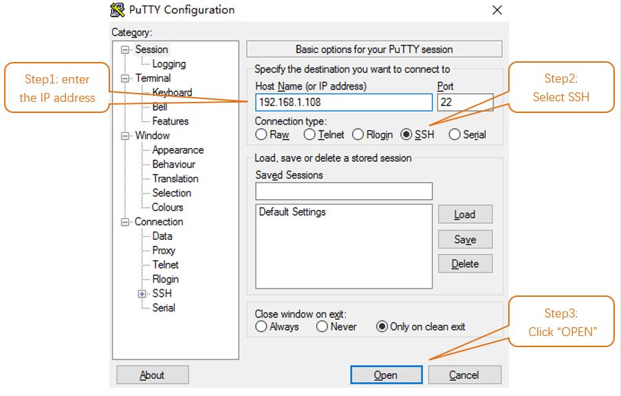

There will appear a security warning at first login. Just click “YES”.

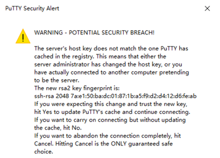

Then there will be a login interface (RPi default user name: pi; the password: raspberry). When you enter the password, there will be no display on the screen. This is normal. After the correct input, press “Enter” to confirm.

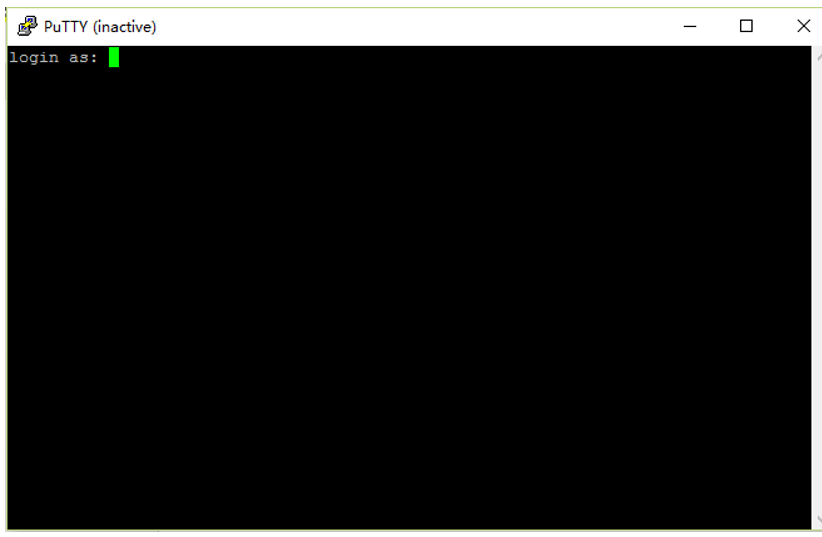

Then enter the command line of RPi, which means that you have successfully login to RPi command line mode.

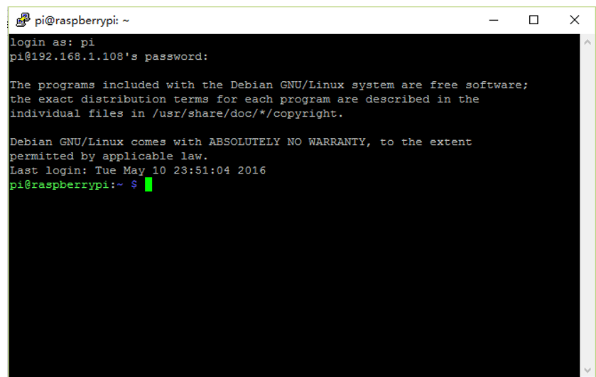

Remote Desktop Connection & xrdp
=======================================

If you want to use built-in Remote Desktop Connection under Windows, you need install xrdp service on Raspberry Pi. 

Next, install a xrdp service, an open source remote desktop protocol(xrdp) server, for RPi. Type the following command, then press enter to confirm:

.. code-block:: console
    
    $ sudo apt-get install xrdp

Later, the installation starts.

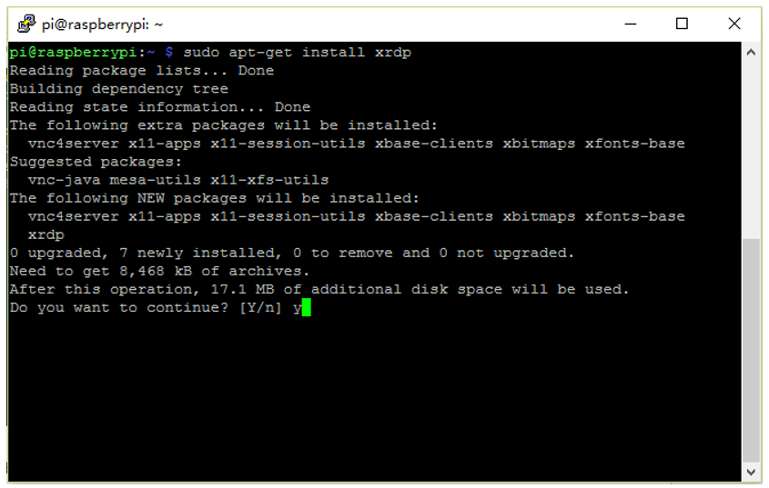

Enter "Y", press key “Enter” to confirm.

After the installation is completed, you can use Windows remote desktop applications to login to your RPi.

Login to Windows remote desktop 
=====================================

Use "WIN+R" or search function, open the remote desktop application "mstsc.exe" under Windows, enter the IP address of RPi and then click “Connect”.

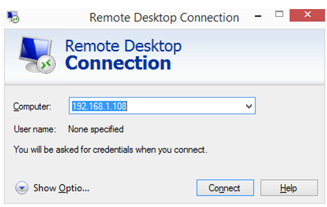

Later, there will be xrdp login screen. Enter the user name and password of RPi (RPi default user name: pi; password: raspberry) and click “OK”.

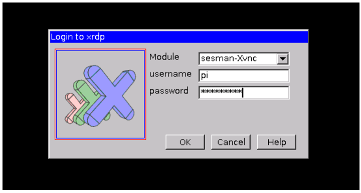

Later, you can enter the RPi desktop system.

.. image:: ../_static/imgs/Preparation/Preparation17.png
    :align: center

Wi-Fi
=================================

Raspberry Pi 4B/3B+/3B integrates a Wi-Fi adaptor. You can use it to connect to your Wi-Fi. Then you can use the wireless remote desktop to control your RPi. This will be helpful for the following work. Raspberry Pi of other models can use wireless remote desktop through accessing an external USB wireless card.

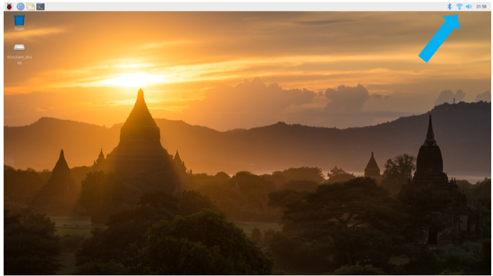

VNC Viewer & VNC 
===================================

Type the following command. And select 5 Interfacing OptionsP3 VNC YesOKFinish. Here Raspberry Pi may need be restarted, and choose ok. Then open VNC interface. 

.. code-block:: console
    
    $ sudo raspi-config

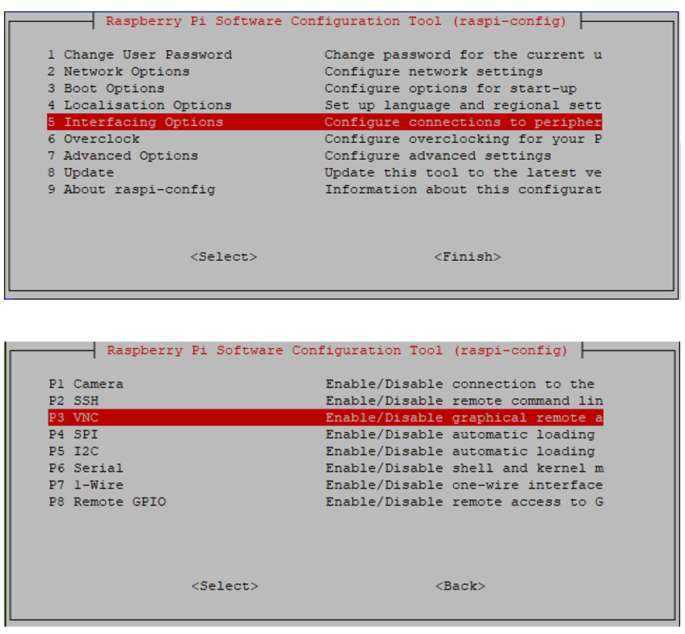

Then download and install VNC Viewer by click following link:

https://www.realvnc.com/en/connect/download/viewer/windows/ 

After installation is completed, open VNC Viewer. And click File -> New Connection. Then the interface is shown below. 

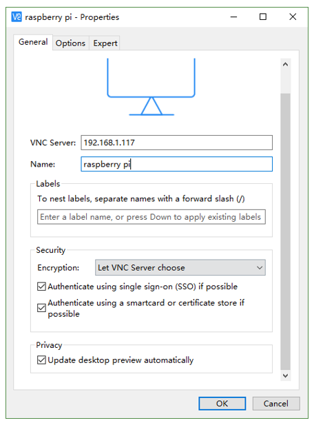

Enter ip address of your Raspberry Pi and fill in a Name. And click OK.

Then on the VNC Viewer panel, double-click new connection you just created, and the following dialog box pops up.  

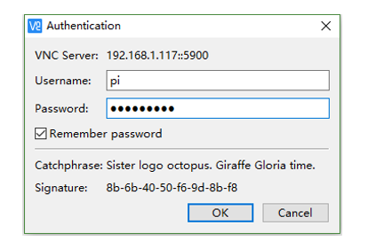

Enter username: pi and Password: raspberry. And click OK.     

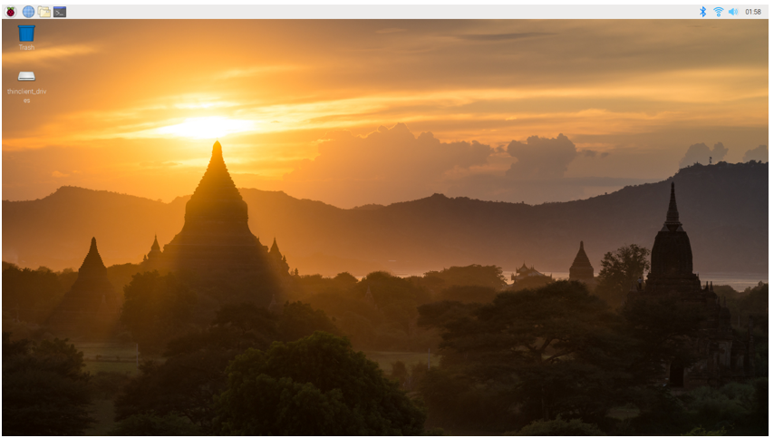

Here, you have logged in to Raspberry Pi successfully by using VNC Viewer

If the resolution ratio is not great or there is just a black little window, you can set a proper resolution ratio via steps below.

.. code-block:: console
    
    $ sudo raspi-config

Select 7 Advanced OptionsA5 Resolutionproper resolution ratio (set by yourself)OKFinish. And then reboot Raspberry Pi. 

In addition, your VNC Viewer window may zoom your Raspberry Pi desktop. You can change it. On your VNC View control panel, click right key. And select Properties->Options label->Scaling. Then set proper scaling. 

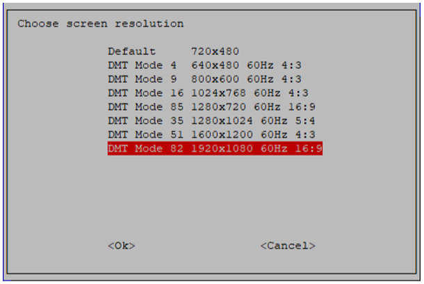

Here, you have logged in to Raspberry Pi successfully by using VNC Viewer and operated proper setting.

