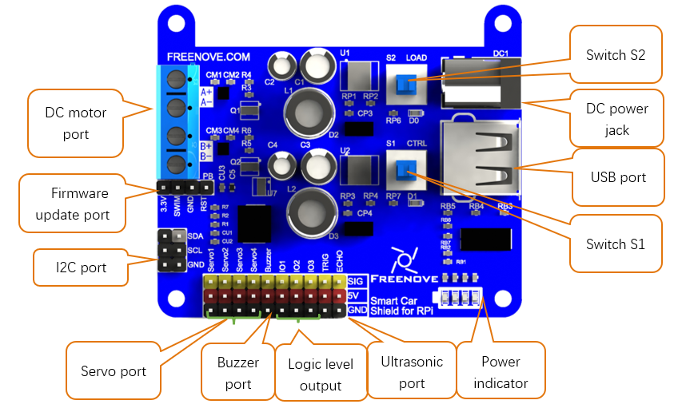

##############################################################################
Smart Car Shield for RPi
##############################################################################

Smart Car Shield for RPi (hereinafter called Shield) is designed to extend smart car control board, which is suitable for control board with host computer communication ability of I2C. The size and position of the location holes on the shield is suitable for RPi. Below is the schematic diagram and function description of the Smart Car Shield for RPi:

- DC power jack: this shield uses 5.6~11V DC power supply. If the power supply is beyond this voltage range, it may cause damage to Shield.

- There are two Voltage Regulation System for 5V/3A, which are controlled by switch S1 and S2 respectively.

a)	First 5V/3A power supply is output by the USB port on the right side of Shield, which is used to provide power for RPi. In addition, the motor driver, controller, battery voltage detector and other systems logic power on the Shield are powered by this one. It is controlled by the switch S1:CTRL for on or off. This means that if you want the Shield to work, you have to turn on the switch S1:CTRL.

b)	Second 5V/3A power is output by the red pins on Shield (marked as 5V). Motor, servo, buzzer, LED, ultrasonic and other load are powered by this one. It is controlled by the switch S2:LOAD for on or off. This means that if you want the load connected to the Shield to work, you have to turn on the switch S2:LOAD.

- Power indicator. Four LEDs are used to indicate the power. With the power consumption, LEDs will be turned off one by one.

- I2C communication port. Shield using I2C communication protocol. The default device address for I2C is 0x18, which can be changed to any address through specific command. And the data can be preserved with power off.

- Firmware update port. If there is a new released firmware, the firmware can be updated through this port. 

- DC motor interface. This shield can control speed and steering of two motors. Maximum current of each motor is 1.8A, and voltage is the input voltage of Shield.

- Servo port. This shield provides four servo ports. The servo control accuracy is 1us, which is 0.09 degrees.

- Buzzer port: This shield provides 1 buzzer port. This port can produce PWM with frequency 0-65535Hz, and duty cycle 50%.

- The logic level output: This shield provides 3 common ports which can output logic level (0V/3.3V).

- Ultrasonic port: This shield provides a SR04 ultrasonic port.

- USB power port: This shield provides a USB power port to supply power for RPi.

The communication and command about this shield will be introduced later.